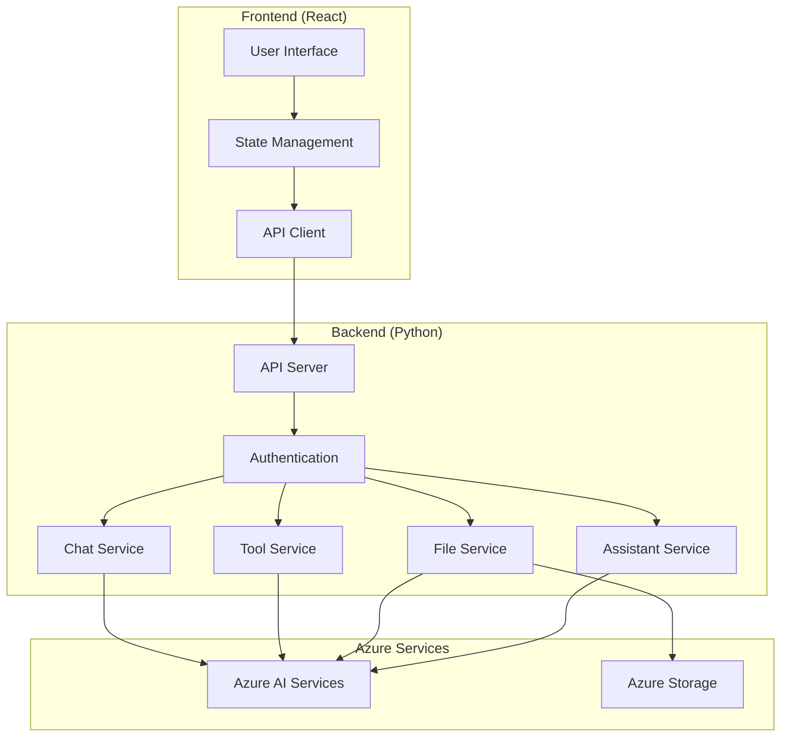

# Design Document: Azure AI Assistant Manager

## Overview

The Azure AI Assistant Manager is a comprehensive system designed to create, manage, and interact with Azure AI Assistants. The system consists of two main components:

1. A Python backend service that provides RESTful APIs for managing Azure AI Assistants using the Azure SDK
2. A React frontend application that provides a user-friendly interface similar to the Azure AI Portal's Assistants playground

This design document outlines the architecture, components, interfaces, data models, error handling, and testing strategy for the system.

## Architecture

The system follows a client-server architecture with a clear separation between the frontend and backend components:

### Backend Architecture

The backend follows a layered architecture:

1. **API Layer**: Handles HTTP requests and responses, input validation, and routing
2. **Service Layer**: Contains business logic for managing assistants, files, tools, and chat sessions
3. **Data Access Layer**: Interacts with Azure AI SDK and handles data persistence
4. **Authentication Layer**: Manages user authentication and authorization

### Frontend Architecture

The frontend follows a component-based architecture using React:

1. **UI Components**: Reusable UI elements like buttons, forms, and cards
2. **Pages**: Main application views (Dashboard, Assistant Details, Chat Interface)
3. **State Management**: Centralized state management using React Context or Redux
4. **API Client**: Handles communication with the backend API

## Components and Interfaces

### Backend Components

#### 1. API Server

- **Framework**: FastAPI
- **Responsibilities**:
  - Route HTTP requests to appropriate handlers
  - Validate request inputs
  - Handle authentication and authorization
  - Return appropriate HTTP responses

#### 2. Assistant Service

- **Responsibilities**:
  - Create, update, delete, and retrieve assistants
  - Configure assistant properties (model, instructions, etc.)
  - Manage assistant metadata

#### 3. File Service

- **Responsibilities**:
  - Upload files to Azure AI services
  - Retrieve file metadata and status
  - Delete files
  - Associate files with assistants

#### 4. Tool Service

- **Responsibilities**:
  - Create, update, delete, and retrieve custom function tools
  - Validate tool configurations
  - Associate tools with assistants

#### 5. Chat Service

- **Responsibilities**:
  - Create chat sessions with assistants
  - Send messages to assistants and retrieve responses
  - Manage conversation history

### Frontend Components

#### 1. Dashboard

- **Responsibilities**:
  - Display a list of existing assistants
  - Provide options to create, edit, or delete assistants
  - Show assistant status and metadata

#### 2. Assistant Configuration

- **Responsibilities**:
  - Provide forms for creating and editing assistants
  - Configure assistant properties (model, instructions, etc.)
  - Manage file and tool associations

#### 3. Chat Interface

- **Responsibilities**:
  - Display conversation history
  - Allow sending messages to assistants
  - Show assistant responses
  - Provide options for configuring chat sessions

#### 4. File Manager

- **Responsibilities**:
  - Upload files for vector store search or code interpreter
  - Display file status and metadata
  - Delete files
  - Associate files with assistants

#### 5. Tool Configuration

- **Responsibilities**:
  - Create and edit custom function tools
  - Define tool parameters and schemas
  - Associate tools with assistants

## API Endpoints

### Assistant Endpoints

- `POST /api/assistants`: Create a new assistant
- `GET /api/assistants`: List all assistants
- `GET /api/assistants/{assistant_id}`: Get assistant details
- `PUT /api/assistants/{assistant_id}`: Update an assistant
- `DELETE /api/assistants/{assistant_id}`: Delete an assistant

### File Endpoints

- `POST /api/files`: Upload a file
- `GET /api/files`: List all files
- `GET /api/files/{file_id}`: Get file details
- `DELETE /api/files/{file_id}`: Delete a file
- `POST /api/assistants/{assistant_id}/files`: Associate a file with an assistant
- `DELETE /api/assistants/{assistant_id}/files/{file_id}`: Remove a file from an assistant

### Tool Endpoints

- `POST /api/tools`: Create a new tool
- `GET /api/tools`: List all tools
- `GET /api/tools/{tool_id}`: Get tool details
- `PUT /api/tools/{tool_id}`: Update a tool
- `DELETE /api/tools/{tool_id}`: Delete a tool
- `POST /api/assistants/{assistant_id}/tools`: Associate a tool with an assistant
- `DELETE /api/assistants/{assistant_id}/tools/{tool_id}`: Remove a tool from an assistant

### Chat Endpoints

- `POST /api/assistants/{assistant_id}/chats`: Create a new chat session
- `GET /api/assistants/{assistant_id}/chats`: List chat sessions for an assistant
- `GET /api/assistants/{assistant_id}/chats/{chat_id}`: Get chat session details
- `POST /api/assistants/{assistant_id}/chats/{chat_id}/messages`: Send a message
- `GET /api/assistants/{assistant_id}/chats/{chat_id}/messages`: Get chat messages
"@