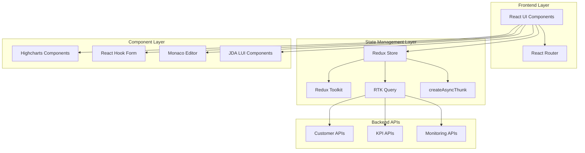

# Design Document

## Overview

The KPI Dashboard is a modern React-based customer monitoring and analytics platform built with Redux Toolkit for state management, RTK Query for data fetching, and Highcharts for data visualization. The system provides comprehensive customer insights through interactive dashboards, detailed customer views, and real-time monitoring capabilities.

The architecture follows modern React patterns with TypeScript, emphasizing performance, accessibility, and maintainability through component-based design and efficient state management.

## Architecture

### High-Level Architecture



### Technology Stack

- **Frontend Framework**: React 18 with TypeScript
- **State Management**: Redux Toolkit with RTK Query and createAsyncThunk
- **Routing**: React Router v6
- **HTTP Client**: Axios with interceptors
- **Charts**: Highcharts React
- **Forms**: React Hook Form with validation
- **Code Editor**: Monaco Editor
- **UI Components**: @jda/lui-common-component-library-mui5 (primary UI library)
- **Icons**: @jda/lui-common-icon-library-mui5 (primary icon library)
- **Testing**: Vitest + React Testing Library
- **Styling**: Tailwind CSS with custom design system
- **Build Tools**: Vite with ESLint and Prettier

**Component Library Usage**:
- **Primary**: Use @jda/lui-common-component-library-mui5 for all UI components
- **Icons**: Use @jda/lui-common-icon-library-mui5 for all icons
- **Fallback**: Only use Material-UI directly if component is not available in JDA libraries

### State Management Architecture

#### Redux Store Structure

```typescript
interface RootState {
  customers: CustomersState
  kpis: KPIsState
  monitoring: MonitoringState
  notifications: NotificationsState
  ui: UIState
  auth: AuthState
}

interface CustomersState {
  list: Customer[]
  selectedCustomer: Customer | null
  filters: CustomerFilters
  pagination: PaginationState
  loading: boolean
  error: string | null
}

interface KPIsState {
  globalMetrics: GlobalKPIs
  customerMetrics: Record<string, CustomerKPIs>
  loading: boolean
  lastUpdated: Date
}

interface MonitoringState {
  sites: Site[]
  timeSeriesData: Record<string, TimeSeriesData>
  alerts: Alert[]
  realTimeMetrics: RealTimeMetrics
  loading: boolean
}
```

#### Redux Toolkit Slices

```typescript
// customers/customersSlice.ts
const customersSlice = createSlice({
  name: 'customers',
  initialState,
  reducers: {
    setCustomers: (state, action) => {
      state.list = action.payload
      state.loading = false
    },
    setSelectedCustomer: (state, action) => {
      state.selectedCustomer = action.payload
    },
    updateFilters: (state, action) => {
      state.filters = { ...state.filters, ...action.payload }
    },
    setLoading: (state, action) => {
      state.loading = action.payload
    }
  }
})

// kpis/kpisSlice.ts
const kpisSlice = createSlice({
  name: 'kpis',
  initialState,
  reducers: {
    setGlobalKPIs: (state, action) => {
      state.globalMetrics = action.payload
      state.lastUpdated = new Date()
    },
    updateCustomerKPIs: (state, action) => {
      const { customerId, kpis } = action.payload
      state.customerMetrics[customerId] = kpis
    }
  }
})
```

#### RTK Query API Slices (Recommended for Data Fetching)

```typescript
// api/customersApi.ts
import { createApi, fetchBaseQuery } from '@reduxjs/toolkit/query/react'

export const customersApi = createApi({
  reducerPath: 'customersApi',
  baseQuery: fetchBaseQuery({
    baseUrl: '/api/customers',
    prepareHeaders: (headers, { getState }) => {
      const token = localStorage.getItem('authToken')
      if (token) {
        headers.set('authorization', `Bearer ${token}`)
      }
      return headers
    },
  }),
  tagTypes: ['Customer', 'CustomerKPIs', 'CustomerProducts'],
  endpoints: (builder) => ({
    // Get customers with automatic caching and loading states
    getCustomers: builder.query<ApiResponse<Customer[]>, CustomerFilters>({
      query: (filters) => ({
        url: '',
        params: filters,
      }),
      providesTags: ['Customer'],
    }),
    
    // Get customer details with automatic parallel fetching
    getCustomerDetails: builder.query<CustomerDetailsResponse, string>({
      query: (customerId) => `/${customerId}`,
      providesTags: (result, error, customerId) => [
        { type: 'Customer', id: customerId }
      ],
    }),
    
    // Get customer KPIs with automatic caching
    getCustomerKPIs: builder.query<ApiResponse<CustomerKPIs>, string>({
      query: (customerId) => `/${customerId}/kpis`,
      providesTags: (result, error, customerId) => [
        { type: 'CustomerKPIs', id: customerId }
      ],
    }),
    
    // Get customer products
    getCustomerProducts: builder.query<ApiResponse<Product[]>, string>({
      query: (customerId) => `/${customerId}/products`,
      providesTags: (result, error, customerId) => [
        { type: 'CustomerProducts', id: customerId }
      ],
    }),
    
    // Update customer with optimistic updates
    updateCustomer: builder.mutation<Customer, { id: string; updates: Partial<Customer> }>({
      query: ({ id, updates }) => ({
        url: `/${id}`,
        method: 'PUT',
        body: updates,
      }),
      invalidatesTags: (result, error, { id }) => [
        { type: 'Customer', id },
        { type: 'CustomerKPIs', id }
      ],
    }),
  }),
})

// Auto-generated hooks for components
export const {
  useGetCustomersQuery,
  useGetCustomerDetailsQuery,
  useGetCustomerKPIsQuery,
  useGetCustomerProductsQuery,
  useUpdateCustomerMutation,
} = customersApi
```

#### createAsyncThunk for Complex Business Logic

```typescript
// features/notifications/notificationsSlice.ts
import { createSlice, createAsyncThunk } from '@reduxjs/toolkit'

// Async thunk for complex WebSocket management
export const connectWebSocket = createAsyncThunk(
  'notifications/connectWebSocket',
  async (_, { dispatch, rejectWithValue }) => {
    try {
      const ws = new WebSocket(process.env.REACT_APP_WS_URL!)
      
      ws.onopen = () => {
        dispatch(setConnectionStatus('connected'))
      }
      
      ws.onmessage = (event) => {
        const data = JSON.parse(event.data)
        dispatch(receiveRealTimeUpdate(data))
      }
      
      ws.onerror = (error) => {
        dispatch(setConnectionStatus('error'))
        throw new Error('WebSocket connection failed')
      }
      
      return ws
    } catch (error) {
      return rejectWithValue(error.message)
    }
  }
)

// Async thunk for batch operations
export const processBatchAlerts = createAsyncThunk(
  'notifications/processBatchAlerts',
  async (alerts: Alert[], { dispatch, getState }) => {
    const processedAlerts = []
    
    for (const alert of alerts) {
      // Complex business logic
      const enrichedAlert = await enrichAlertWithContext(alert)
      const shouldNotify = await checkNotificationRules(enrichedAlert)
      
      if (shouldNotify) {
        dispatch(showNotification(enrichedAlert))
      }
      
      processedAlerts.push(enrichedAlert)
    }
    
    return processedAlerts
  }
)

const notificationsSlice = createSlice({
  name: 'notifications',
  initialState: {
    alerts: [],
    connectionStatus: 'disconnected',
    loading: false,
    error: null,
  },
  reducers: {
    setConnectionStatus: (state, action) => {
      state.connectionStatus = action.payload
    },
    receiveRealTimeUpdate: (state, action) => {
      // Handle real-time updates
      state.alerts.unshift(action.payload)
    },
    showNotification: (state, action) => {
      // Show notification logic
    },
  },
  extraReducers: (builder) => {
    builder
      .addCase(connectWebSocket.pending, (state) => {
        state.loading = true
        state.error = null
      })
      .addCase(connectWebSocket.fulfilled, (state, action) => {
        state.loading = false
        // WebSocket instance stored elsewhere
      })
      .addCase(connectWebSocket.rejected, (state, action) => {
        state.loading = false
        state.error = action.payload as string
      })
      .addCase(processBatchAlerts.fulfilled, (state, action) => {
        state.alerts = action.payload
      })
  },
})
```

#### Component Usage Examples

```typescript
// Using RTK Query in components (much simpler than Saga)
const CustomerListPage: React.FC = () => {
  const [filters, setFilters] = useState<CustomerFilters>({})
  
  // Automatic loading states, caching, and refetching
  const {
    data: customersResponse,
    isLoading,
    isError,
    error,
    refetch
  } = useGetCustomersQuery(filters)
  
  const customers = customersResponse?.data || []
  
  if (isLoading) return <CustomerTableSkeleton />
  if (isError) return <ErrorMessage error={error} onRetry={refetch} />
  
  return (
    <Box>
      <CustomerFilters onFiltersChange={setFilters} />
      <CustomerTable 
        customers={customers}
        onCustomerSelect={(id) => navigate(`/customer/${id}`)}
      />
    </Box>
  )
}

// Using multiple queries with automatic parallel fetching
const CustomerDetailPage: React.FC = () => {
  const { customerId } = useParams<{ customerId: string }>()
  
  // All queries run in parallel automatically
  const { data: customer, isLoading: customerLoading } = useGetCustomerDetailsQuery(customerId!)
  const { data: kpis, isLoading: kpisLoading } = useGetCustomerKPIsQuery(customerId!)
  const { data: products, isLoading: productsLoading } = useGetCustomerProductsQuery(customerId!)
  
  const isLoading = customerLoading || kpisLoading || productsLoading
  
  if (isLoading) return <CustomerDetailSkeleton />
  
  return (
    <Box>
      <CustomerHeader customer={customer?.data} />
      <KPIOverview kpis={kpis?.data} />
      <ProductSolutions products={products?.data} />
    </Box>
  )
}

// Using mutations with optimistic updates
const CustomerActions: React.FC<{ customer: Customer }> = ({ customer }) => {
  const [updateCustomer, { isLoading }] = useUpdateCustomerMutation()
  
  const handleStatusChange = async (newStatus: string) => {
    try {
      await updateCustomer({
        id: customer.id,
        updates: { status: newStatus }
      }).unwrap()
      
      // Success handled automatically by RTK Query
      showSuccessToast('Customer updated successfully')
    } catch (error) {
      showErrorToast('Failed to update customer')
    }
  }
  
  return (
    <Button 
      onClick={() => handleStatusChange('active')}
      disabled={isLoading}
    >
      {isLoading ? 'Updating...' : 'Activate Customer'}
    </Button>
  )
}
```

## Components Architecture

### Component Hierarchy

```
App
├── Router
│   ├── DashboardLayout
│   │   ├── Header
│   │   │   ├── NotificationBell
│   │   │   └── UserMenu
│   │   ├── Sidebar (optional)
│   │   └── MainContent
│   │       ├── CustomerListPage
│   │       │   ├── KPICards
│   │       │   ├── SearchBar
│   │       │   ├── FilterBar
│   │       │   └── CustomerTable
│   │       └── CustomerDetailPage
│   │           ├── CustomerHeader
│   │           ├── AlertBanner
│   │           ├── WhatsNewSection
│   │           ├── KPIOverview
│   │           ├── ProductSolutions
│   │           └── SiteMonitoring
│   └── ErrorBoundary
```

### Core Components

#### 1. Customer List Components

```typescript
// components/customers/CustomerTable.tsx
import { 
  Table, 
  TableHead, 
  TableBody, 
  TableRow, 
  TableCell,
  TableContainer,
  Paper,
  Chip,
  Button,
  Skeleton
} from '@jda/lui-common-component-library-mui5'
import { 
  PersonIcon, 
  BusinessIcon, 
  AlertIcon 
} from '@jda/lui-common-icon-library-mui5'

interface CustomerTableProps {
  customers: Customer[]
  loading: boolean
  onCustomerSelect: (customerId: string) => void
  onSort: (field: string, direction: 'asc' | 'desc') => void
}

const CustomerTable: React.FC<CustomerTableProps> = ({
  customers,
  loading,
  onCustomerSelect,
  onSort
}) => {
  if (loading) {
    return (
      <TableContainer component={Paper}>
        <Table>
          <TableHead>
            <TableRow>
              <TableCell>Customer</TableCell>
              <TableCell>Industry</TableCell>
              <TableCell>Active Subscriptions</TableCell>
              <TableCell>Alerts</TableCell>
            </TableRow>
          </TableHead>
          <TableBody>
            {Array.from({ length: 10 }).map((_, index) => (
              <TableRow key={index}>
                <TableCell><Skeleton width="60%" /></TableCell>
                <TableCell><Skeleton width="40%" /></TableCell>
                <TableCell><Skeleton width="80%" /></TableCell>
                <TableCell><Skeleton width="30%" /></TableCell>
              </TableRow>
            ))}
          </TableBody>
        </Table>
      </TableContainer>
    )
  }

  return (
    <TableContainer component={Paper}>
      <Table>
        <TableHead>
          <TableRow>
            <TableCell>Customer</TableCell>
            <TableCell>Industry</TableCell>
            <TableCell>Active Subscriptions</TableCell>
            <TableCell>Alerts</TableCell>
          </TableRow>
        </TableHead>
        <TableBody>
          {customers.map((customer) => (
            <TableRow key={customer.id} hover>
              <TableCell>
                <Button
                  variant="text"
                  startIcon={<PersonIcon />}
                  onClick={() => onCustomerSelect(customer.id)}
                  sx={{ textTransform: 'none' }}
                >
                  {customer.name}
                </Button>
              </TableCell>
              <TableCell>
                <Chip
                  icon={<BusinessIcon />}
                  label={customer.industry}
                  variant="outlined"
                  size="small"
                />
              </TableCell>
              <TableCell>
                {customer.subscriptions.map((sub) => (
                  <Chip
                    key={sub.id}
                    label={sub.name}
                    size="small"
                    sx={{ mr: 0.5, mb: 0.5 }}
                  />
                ))}
              </TableCell>
              <TableCell>
                <Chip
                  icon={<AlertIcon />}
                  label={customer.alertCount}
                  color={customer.maxAlertSeverity === 'critical' ? 'error' : 
                         customer.maxAlertSeverity === 'high' ? 'warning' : 'default'}
                  size="small"
                />
              </TableCell>
            </TableRow>
          ))}
        </TableBody>
      </Table>
    </TableContainer>
  )
}
```

#### 2. KPI Components

```typescript
// components/kpis/KPICard.tsx
import { 
  Card, 
  CardContent, 
  Typography, 
  Box,
  Chip
} from '@jda/lui-common-component-library-mui5'
import { 
  TrendingUpIcon, 
  TrendingDownIcon, 
  TrendingFlatIcon 
} from '@jda/lui-common-icon-library-mui5'

interface KPICardProps {
  title: string
  value: number | string
  trend?: {
    direction: 'up' | 'down' | 'stable'
    percentage: number
  }
  status?: 'healthy' | 'warning' | 'critical'
  icon?: React.ReactNode
  onClick?: () => void
}

const KPICard: React.FC<KPICardProps> = ({
  title,
  value,
  trend,
  status = 'healthy',
  icon,
  onClick
}) => {
  const getStatusColor = () => {
    switch (status) {
      case 'critical': return 'error'
      case 'warning': return 'warning'
      default: return 'success'
    }
  }

  const getTrendIcon = () => {
    switch (trend?.direction) {
      case 'up': return <TrendingUpIcon color="success" />
      case 'down': return <TrendingDownIcon color="error" />
      default: return <TrendingFlatIcon color="disabled" />
    }
  }

  return (
    <Card 
      sx={{ 
        cursor: onClick ? 'pointer' : 'default',
        '&:hover': onClick ? { boxShadow: 3 } : {},
        border: `1px solid`,
        borderColor: `${getStatusColor()}.light`
      }}
      onClick={onClick}
    >
      <CardContent>
        <Box display="flex" justifyContent="space-between" alignItems="center" mb={2}>
          <Typography variant="subtitle2" color="text.secondary">
            {title}
          </Typography>
          {icon && (
            <Box color="text.secondary">
              {icon}
            </Box>
          )}
        </Box>
        
        <Box display="flex" justifyContent="space-between" alignItems="end">
          <Typography variant="h4" component="div" fontWeight="bold">
            {typeof value === 'number' ? value.toLocaleString() : value}
          </Typography>
          
          {trend && (
            <Chip
              icon={getTrendIcon()}
              label={`${trend.percentage}%`}
              size="small"
              variant="outlined"
              color={trend.direction === 'up' ? 'success' : 
                     trend.direction === 'down' ? 'error' : 'default'}
            />
          )}
        </Box>
      </CardContent>
    </Card>
  )
}
```

#### 3. Chart Components

```typescript
// components/charts/TimeSeriesChart.tsx
interface TimeSeriesChartProps {
  data: TimeSeriesData[]
  title: string
  height?: number
  showViolations?: boolean
  onPointClick?: (point: TimeSeriesPoint) => void
}

const TimeSeriesChart: React.FC<TimeSeriesChartProps> = ({
  data,
  title,
  height = 300,
  showViolations = false,
  onPointClick
}) => {
  const chartOptions = useMemo<Highcharts.Options>(() => ({
    chart: {
      type: 'line',
      height,
      backgroundColor: 'transparent'
    },
    title: {
      text: title,
      style: {
        fontSize: '14px',
        fontWeight: '600'
      }
    },
    xAxis: {
      type: 'datetime',
      labels: {
        format: '{value:%H:%M}'
      }
    },
    yAxis: {
      title: {
        text: 'Value'
      }
    },
    series: [{
      name: 'Metric Value',
      data: data.map(point => [
        new Date(point.timestamp).getTime(),
        point.value
      ]),
      color: '#3B82F6'
    }],
    plotOptions: {
      line: {
        marker: {
          enabled: true,
          radius: 3
        },
        point: {
          events: {
            click: function() {
              if (onPointClick) {
                onPointClick(this.options as TimeSeriesPoint)
              }
            }
          }
        }
      }
    },
    tooltip: {
      formatter: function() {
        return `<b>${this.series.name}</b><br/>
                ${Highcharts.dateFormat('%H:%M', this.x as number)}: ${this.y}`
      }
    }
  }), [data, title, height, onPointClick])

  return (
    <div className="chart-container">
      <HighchartsReact
        highcharts={Highcharts}
        options={chartOptions}
      />
      {showViolations && (
        <ViolationIndicators data={data} />
      )}
    </div>
  )
}
```

#### 4. Form Components

```typescript
// components/forms/CustomerFilters.tsx
import { 
  Box,
  FormControl,
  InputLabel,
  Select,
  MenuItem,
  TextField,
  Button,
  Paper
} from '@jda/lui-common-component-library-mui5'
import { 
  SearchIcon,
  ClearIcon,
  FilterListIcon 
} from '@jda/lui-common-icon-library-mui5'

interface CustomerFiltersProps {
  onFiltersChange: (filters: CustomerFilters) => void
  initialFilters?: CustomerFilters
}

const CustomerFilters: React.FC<CustomerFiltersProps> = ({
  onFiltersChange,
  initialFilters = {}
}) => {
  const { control, watch, reset } = useForm<CustomerFilters>({
    defaultValues: initialFilters
  })

  const filters = watch()

  useEffect(() => {
    onFiltersChange(filters)
  }, [filters, onFiltersChange])

  return (
    <Paper sx={{ p: 3, mb: 3 }}>
      <Box display="flex" flexWrap="wrap" gap={2} alignItems="center">
        <Controller
          name="search"
          control={control}
          render={({ field }) => (
            <TextField
              {...field}
              placeholder="Search customers..."
              variant="outlined"
              size="small"
              InputProps={{
                startAdornment: <SearchIcon sx={{ mr: 1, color: 'text.secondary' }} />
              }}
              sx={{ minWidth: 250 }}
            />
          )}
        />
        
        <Controller
          name="industry"
          control={control}
          render={({ field }) => (
            <FormControl size="small" sx={{ minWidth: 200 }}>
              <InputLabel>Industry</InputLabel>
              <Select {...field} label="Industry">
                <MenuItem value="">All Industries</MenuItem>
                <MenuItem value="technology">Technology</MenuItem>
                <MenuItem value="healthcare">Healthcare</MenuItem>
                <MenuItem value="finance">Finance</MenuItem>
                <MenuItem value="retail">Retail</MenuItem>
                <MenuItem value="manufacturing">Manufacturing</MenuItem>
              </Select>
            </FormControl>
          )}
        />
        
        <Controller
          name="status"
          control={control}
          render={({ field }) => (
            <FormControl size="small" sx={{ minWidth: 150 }}>
              <InputLabel>Status</InputLabel>
              <Select {...field} label="Status">
                <MenuItem value="">All Status</MenuItem>
                <MenuItem value="active">Active</MenuItem>
                <MenuItem value="inactive">Inactive</MenuItem>
                <MenuItem value="suspended">Suspended</MenuItem>
              </Select>
            </FormControl>
          )}
        />
        
        <Controller
          name="alertLevel"
          control={control}
          render={({ field }) => (
            <FormControl size="small" sx={{ minWidth: 150 }}>
              <InputLabel>Alert Level</InputLabel>
              <Select {...field} label="Alert Level">
                <MenuItem value="">All Levels</MenuItem>
                <MenuItem value="critical">Critical</MenuItem>
                <MenuItem value="high">High</MenuItem>
                <MenuItem value="medium">Medium</MenuItem>
                <MenuItem value="low">Low</MenuItem>
              </Select>
            </FormControl>
          )}
        />
        
        <Button
          variant="outlined"
          startIcon={<ClearIcon />}
          onClick={() => reset()}
          sx={{ ml: 'auto' }}
        >
          Clear Filters
        </Button>
      </Box>
    </Paper>
  )
}
```

## Data Models

### Core Data Models

```typescript
// types/customer.ts
interface Customer {
  id: string
  name: string
  status: 'active' | 'inactive' | 'suspended'
  tier: 'enterprise' | 'professional' | 'basic'
  industry: string
  subscriptions: Subscription[]
  connectionUsage: {
    current: number
    limit: number
    percentage: number
  }
  alertCount: number
  maxAlertSeverity: 'low' | 'medium' | 'high' | 'critical'
  lastActivity: Date
  kpis: CustomerKPIs
  contact: {
    email: string
    phone: string
  }
  billing: {
    plan: string
    billingCycle: 'monthly' | 'yearly'
    nextBilling: Date
  }
}

interface Subscription {
  id: string
  name: string
  status: 'active' | 'inactive'
  type: string
}

interface CustomerKPIs {
  revenue: number
  growth: number
  satisfaction: number
  uptime: number
  responseTime: number
  errorRate: number
}

// types/kpi.ts
interface GlobalKPIs {
  totalCustomers: number
  activeCustomers: number
  criticalAlerts: number
  totalRevenue: number
  growthRate: number
  avgSatisfaction: number
  platformUptime: number
  avgResponseTime: number
  errorRate: number
}

// types/monitoring.ts
interface Site {
  id: string
  name: string
  region: string
  status: 'active' | 'inactive' | 'warning'
  slaViolations: number
  lastViolation: Date | null
  metrics: {
    uptime: number
    responseTime: number
    throughput: number
  }
}

interface TimeSeriesData {
  timestamp: Date
  value: number
  violations: number
}

interface Alert {
  id: string
  customerId?: string
  type: 'system' | 'customer' | 'performance'
  severity: 'low' | 'medium' | 'high' | 'critical'
  title: string
  message: string
  timestamp: Date
  resolved: boolean
  product?: string
}

// types/ui.ts
interface UIState {
  sidebarOpen: boolean
  theme: 'light' | 'dark'
  notifications: Notification[]
  loading: Record<string, boolean>
  errors: Record<string, string>
}

interface Notification {
  id: string
  type: 'info' | 'success' | 'warning' | 'error'
  title: string
  message: string
  timestamp: Date
  read: boolean
  actions?: NotificationAction[]
}

interface NotificationAction {
  text: string
  url?: string
  onClick?: () => void
}
```

## API Integration

### API Service Layer

```typescript
// services/api.ts
class ApiService {
  private client: AxiosInstance

  constructor() {
    this.client = axios.create({
      baseURL: process.env.REACT_APP_API_BASE_URL,
      timeout: 10000,
      headers: {
        'Content-Type': 'application/json'
      }
    })

    this.setupInterceptors()
  }

  private setupInterceptors() {
    // Request interceptor
    this.client.interceptors.request.use(
      (config) => {
        const token = localStorage.getItem('authToken')
        if (token) {
          config.headers.Authorization = `Bearer ${token}`
        }
        return config
      },
      (error) => Promise.reject(error)
    )

    // Response interceptor
    this.client.interceptors.response.use(
      (response) => response,
      (error) => {
        if (error.response?.status === 401) {
          // Handle unauthorized access
          window.location.href = '/login'
        }
        return Promise.reject(error)
      }
    )
  }

  async get<T>(url: string, params?: any): Promise<ApiResponse<T>> {
    const response = await this.client.get(url, { params })
    return response.data
  }

  async post<T>(url: string, data?: any): Promise<ApiResponse<T>> {
    const response = await this.client.post(url, data)
    return response.data
  }

  async put<T>(url: string, data?: any): Promise<ApiResponse<T>> {
    const response = await this.client.put(url, data)
    return response.data
  }

  async delete<T>(url: string): Promise<ApiResponse<T>> {
    const response = await this.client.delete(url)
    return response.data
  }
}

// services/customerApi.ts
class CustomerApiService {
  constructor(private api: ApiService) {}

  async getCustomers(filters: CustomerFilters): Promise<ApiResponse<Customer[]>> {
    return this.api.get('/customers', filters)
  }

  async getCustomer(customerId: string): Promise<ApiResponse<Customer>> {
    return this.api.get(`/customers/${customerId}`)
  }

  async getCustomerKPIs(customerId: string): Promise<ApiResponse<CustomerKPIs>> {
    return this.api.get(`/customers/${customerId}/kpis`)
  }

  async getCustomerProducts(customerId: string): Promise<ApiResponse<Product[]>> {
    return this.api.get(`/customers/${customerId}/products`)
  }

  async getCustomerAlerts(customerId: string): Promise<ApiResponse<Alert[]>> {
    return this.api.get(`/customers/${customerId}/alerts`)
  }

  async getCustomerTimeSeries(customerId: string, params: TimeSeriesParams): Promise<ApiResponse<TimeSeriesData[]>> {
    return this.api.get(`/customers/${customerId}/timeseries`, params)
  }
}
```

## Performance Optimization

### Code Splitting and Lazy Loading

```typescript
// Lazy load pages
const CustomerListPage = lazy(() => import('../pages/CustomerListPage'))
const CustomerDetailPage = lazy(() => import('../pages/CustomerDetailPage'))

// Route configuration with suspense
const AppRouter = () => (
  <Router>
    <Routes>
      <Route path="/" element={
        <Suspense fallback={<PageSkeleton />}>
          <CustomerListPage />
        </Suspense>
      } />
      <Route path="/customer/:customerId" element={
        <Suspense fallback={<PageSkeleton />}>
          <CustomerDetailPage />
        </Suspense>
      } />
    </Routes>
  </Router>
)
```

### Memoization and Optimization

```typescript
// Memoized selectors
const selectCustomersWithFilters = createSelector(
  [
    (state: RootState) => state.customers.list,
    (state: RootState) => state.customers.filters
  ],
  (customers, filters) => {
    return customers.filter(customer => {
      if (filters.industry && customer.industry !== filters.industry) {
        return false
      }
      if (filters.status && customer.status !== filters.status) {
        return false
      }
      if (filters.search) {
        const searchLower = filters.search.toLowerCase()
        return customer.name.toLowerCase().includes(searchLower) ||
               customer.industry.toLowerCase().includes(searchLower)
      }
      return true
    })
  }
)

// Memoized components
const CustomerCard = memo<CustomerCardProps>(({ customer, onClick }) => {
  return (
    <div className="customer-card" onClick={() => onClick(customer.id)}>
      <h3>{customer.name}</h3>
      <p>{customer.industry}</p>
      <AlertBadge count={customer.alertCount} />
    </div>
  )
})

// Virtual scrolling for large lists
const VirtualizedCustomerList = ({ customers }: { customers: Customer[] }) => {
  const rowRenderer = useCallback(({ index, key, style }: ListRowProps) => (
    <div key={key} style={style}>
      <CustomerCard customer={customers[index]} />
    </div>
  ), [customers])

  return (
    <AutoSizer>
      {({ height, width }) => (
        <List
          height={height}
          width={width}
          rowCount={customers.length}
          rowHeight={120}
          rowRenderer={rowRenderer}
        />
      )}
    </AutoSizer>
  )
}
```

## Testing Strategy

### Unit Testing with Vitest

```typescript
// __tests__/components/KPICard.test.tsx
import { render, screen, fireEvent } from '@testing-library/react'
import { KPICard } from '../KPICard'

describe('KPICard', () => {
  it('renders KPI data correctly', () => {
    const props = {
      title: 'Total Customers',
      value: 547,
      trend: { direction: 'up' as const, percentage: 12.5 },
      status: 'healthy' as const
    }

    render(<KPICard {...props} />)

    expect(screen.getByText('Total Customers')).toBeInTheDocument()
    expect(screen.getByText('547')).toBeInTheDocument()
    expect(screen.getByText('12.5%')).toBeInTheDocument()
  })

  it('handles click events', () => {
    const handleClick = vi.fn()
    render(
      <KPICard
        title="Test KPI"
        value={100}
        onClick={handleClick}
      />
    )

    fireEvent.click(screen.getByRole('button'))
    expect(handleClick).toHaveBeenCalledTimes(1)
  })
})
```

### Integration Testing

```typescript
// __tests__/pages/CustomerListPage.test.tsx
import { render, screen, waitFor } from '@testing-library/react'
import { Provider } from 'react-redux'
import { CustomerListPage } from '../CustomerListPage'
import { createMockStore } from '../../utils/testUtils'

describe('CustomerListPage', () => {
  it('loads and displays customer data', async () => {
    const mockStore = createMockStore({
      customers: {
        list: [
          { id: '1', name: 'Test Customer', industry: 'Technology' }
        ],
        loading: false
      }
    })

    render(
      <Provider store={mockStore}>
        <CustomerListPage />
      </Provider>
    )

    await waitFor(() => {
      expect(screen.getByText('Test Customer')).toBeInTheDocument()
    })
  })
})
```

## Accessibility

### ARIA Labels and Semantic HTML

```typescript
const CustomerTable = () => (
  <table role="table" aria-label="Customer list">
    <thead>
      <tr role="row">
        <th role="columnheader" aria-sort="ascending">
          Customer Name
        </th>
        <th role="columnheader">Industry</th>
        <th role="columnheader">Alerts</th>
      </tr>
    </thead>
    <tbody>
      {customers.map(customer => (
        <tr key={customer.id} role="row">
          <td role="gridcell">
            <button
              aria-label={`View details for ${customer.name}`}
              onClick={() => navigate(`/customer/${customer.id}`)}
            >
              {customer.name}
            </button>
          </td>
          <td role="gridcell">{customer.industry}</td>
          <td role="gridcell">
            <span
              aria-label={`${customer.alertCount} alerts`}
              className="alert-badge"
            >
              {customer.alertCount}
            </span>
          </td>
        </tr>
      ))}
    </tbody>
  </table>
)
```

### Keyboard Navigation

```typescript
const useKeyboardNavigation = (items: any[], onSelect: (item: any) => void) => {
  const [selectedIndex, setSelectedIndex] = useState(0)

  useEffect(() => {
    const handleKeyDown = (event: KeyboardEvent) => {
      switch (event.key) {
        case 'ArrowDown':
          event.preventDefault()
          setSelectedIndex(prev => Math.min(prev + 1, items.length - 1))
          break
        case 'ArrowUp':
          event.preventDefault()
          setSelectedIndex(prev => Math.max(prev - 1, 0))
          break
        case 'Enter':
          event.preventDefault()
          onSelect(items[selectedIndex])
          break
      }
    }

    document.addEventListener('keydown', handleKeyDown)
    return () => document.removeEventListener('keydown', handleKeyDown)
  }, [items, selectedIndex, onSelect])

  return selectedIndex
}
```

## JDA LUI Component Library Integration

### Component Library Usage Guidelines

**Primary Component Sources (in order of preference):**
1. **@jda/lui-common-component-library-mui5** - Use for all UI components (Button, TextField, Card, Table, etc.)
2. **@jda/lui-common-icon-library-mui5** - Use for all icons and iconography
3. **Material-UI Direct** - Only use if component is not available in JDA libraries

### Common JDA LUI Components Mapping

```typescript
// Import from JDA LUI libraries
import {
  // Layout & Structure
  Box, Container, Grid, Paper, Card, CardContent, CardHeader, CardActions,
  
  // Navigation
  AppBar, Toolbar, Breadcrumbs, Tabs, Tab,
  
  // Data Display
  Table, TableHead, TableBody, TableRow, TableCell, TablePagination,
  Typography, Chip, Badge, Avatar, Divider,
  
  // Inputs
  TextField, Select, MenuItem, FormControl, InputLabel, Autocomplete,
  Button, IconButton, Switch, Checkbox, Radio,
  
  // Feedback
  Alert, Snackbar, Dialog, DialogTitle, DialogContent, DialogActions,
  CircularProgress, LinearProgress, Skeleton,
  
  // Utils
  Tooltip, Popper, Menu, Collapse
} from '@jda/lui-common-component-library-mui5'

// Import icons from JDA LUI icon library
import {
  SearchIcon, ClearIcon, FilterListIcon, NotificationsIcon,
  PersonIcon, BusinessIcon, AlertIcon, TrendingUpIcon,
  ExpandMoreIcon, CloseIcon, InfoIcon, WarningIcon,
  ShoppingCartIcon, ErrorIcon
} from '@jda/lui-common-icon-library-mui5'
```

### Theme Integration

```typescript
// Ensure JDA LUI components work with custom theming
import { ThemeProvider, createTheme } from '@jda/lui-common-component-library-mui5'

const customTheme = createTheme({
  // Extend JDA LUI theme with project-specific customizations
  palette: {
    primary: {
      main: '#1976d2', // Customize as needed
    },
    secondary: {
      main: '#dc004e',
    },
  },
  // Ensure compatibility with existing JDA LUI styling
})
```

### Development Best Practices

1. **Component Consistency**: Always check JDA LUI libraries first before using Material-UI directly
2. **Icon Usage**: Use @jda/lui-common-icon-library-mui5 for all icons to maintain visual consistency
3. **Theme Compatibility**: Ensure custom styling works with JDA LUI component theming
4. **Documentation**: Document any cases where Material-UI is used directly due to missing JDA LUI components
5. **Testing**: Test components with JDA LUI styling to ensure proper rendering

This design provides a comprehensive foundation for building a modern, scalable, and accessible KPI Dashboard with React, Redux Toolkit, JDA LUI component libraries, and modern development practices.