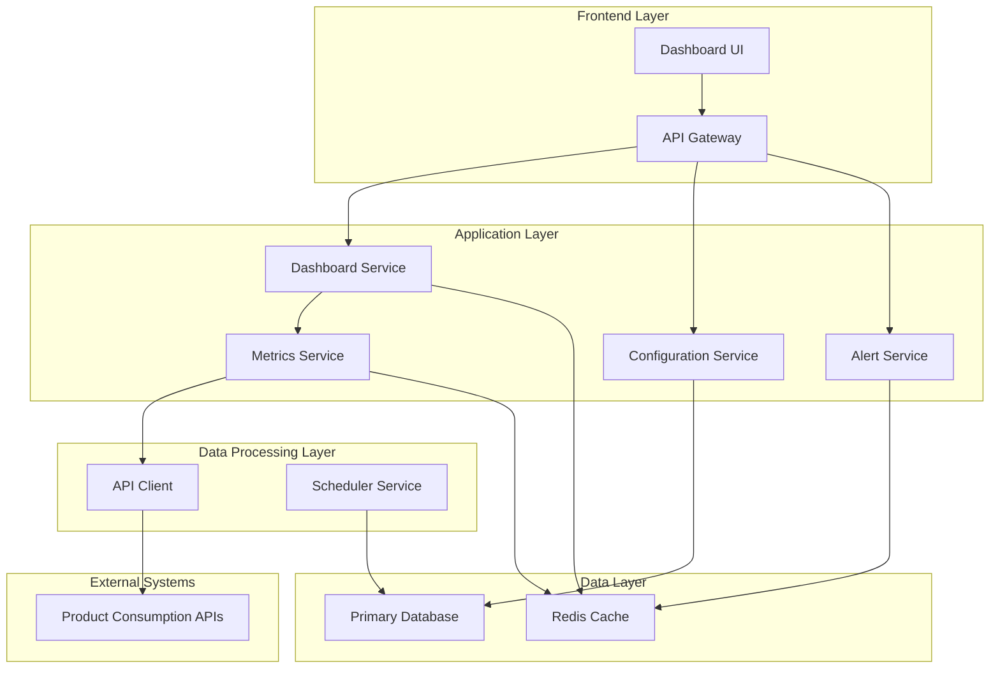

# Design Document

## Overview

The Product Consumption KPI Dashboard is a real-time monitoring and analytics platform designed to track product usage against contractual commitments and service level constraints. The system provides comprehensive visibility into consumption patterns across multiple products, sites, and time periods, enabling proactive compliance management and resource optimization.

The architecture follows a microservices pattern with event-driven data processing, real-time visualization capabilities, and flexible configuration management to support diverse product requirements and consumption patterns.

## Architecture

### High-Level Architecture



### Technology Stack

- **Frontend**: React/TypeScript with real-time charting libraries (Chart.js, D3.js)
- **Backend**: Node.js/Express or Python/FastAPI for REST APIs
- **Real-time Processing**: On-demand API calls with Redis caching for performance optimization
- **Primary Database**: MongoDB for configuration and operational data (no consumption metrics storage)
- **Caching**: Redis for real-time dashboard data and session management
- **Scheduling**: Cron jobs or Apache Airflow for monthly resets and aggregations

### MongoDB Database Architecture

The system uses MongoDB as the single primary database to minimize infrastructure complexity:

**MongoDB for Configuration and Operational Data:**
- Flexible document structure for product configurations and constraints
- Alert storage and lifecycle management
- API integration configurations and authentication details
- Short-term caching of frequently accessed consumption data (optional, with TTL)
- Single database instance for operational workloads

**Collection Structure:**
- `productConfigurations`: Product settings, contractual commitments, and service constraints
- `alerts`: Alert definitions, status, and history
- `apiIntegrations`: Product API configuration and authentication details
- `cacheMetrics`: Short-term cache for frequently accessed consumption data (optional, with TTL)

**Benefits of MongoDB Approach:**
- Schema flexibility for diverse product configurations without migrations
- Native time-series support with automatic optimization
- Document-based storage matches complex nested configuration structures
- Built-in aggregation pipeline for complex analytics queries
- Simplified deployment and maintenance with single database technology
- Horizontal scaling capabilities for high-volume consumption data

### Data Sources and Consumption Data Flow

The system ingests consumption data from product teams via standardized APIs to provide comprehensive monitoring:

#### Primary Data Source

**Product Consumption APIs**
- Each product team provides a dedicated API endpoint that exposes their consumption metrics
- APIs follow a standardized contract for consistent data ingestion
- Support both real-time streaming and batch data retrieval patterns
- Include all relevant consumption metrics as defined in their contractual commitments and service constraints

#### API Contract Specification

```typescript
interface ProductConsumptionAPI {
  // Get current consumption for all metrics
  getCurrentConsumption(productId: string): Promise<ConsumptionSnapshot>
  
  // Get historical consumption data for time range
  getHistoricalConsumption(productId: string, timeRange: TimeRange): Promise<ConsumptionHistory>
  
  // Get consumption data for specific sites
  getSiteConsumption(productId: string, siteIds: string[]): Promise<SiteConsumptionData>
  
  // Real-time consumption updates via webhook or streaming
  subscribeToConsumptionUpdates(callback: (data: ConsumptionEvent) => void): void
}

interface ConsumptionSnapshot {
  productId: string
  timestamp: Date
  metrics: ConsumptionMetric[]
  siteMetrics: SiteConsumptionMetric[]
}

interface ConsumptionMetric {
  metricName: string
  currentValue: number
  unit: string
  timeWindow: string
  resetDate?: Date
}
```

#### Data Ingestion Patterns

The system supports flexible ingestion patterns to accommodate different product team capabilities:

```typescript
interface ProductAPIIngestionStrategy {
  // Polling-based ingestion for products with REST APIs
  pollingIngestion: {
    endpoint: string
    schedule: 'every_minute' | 'every_5_minutes' | 'hourly'
    authentication: APIAuthentication
  }
  
  // Webhook-based ingestion for real-time updates
  webhookIngestion: {
    webhookUrl: string
    authentication: WebhookAuthentication
    retryPolicy: RetryPolicy
  }
  
  // Streaming ingestion for high-volume products
  streamingIngestion: {
    streamEndpoint: string
    protocol: 'websocket' | 'server-sent-events'
    authentication: StreamAuthentication
  }
}
```

#### Real-Time Data Flow Architecture

1. **API Integration Layer**: Connects to product team APIs on-demand for real-time consumption data
2. **Data Validation Layer**: Validates incoming consumption data against API contracts
3. **Enrichment Layer**: Combines raw consumption data with configuration limits and constraints
4. **Caching Layer**: Redis provides short-term caching for frequently accessed data to improve performance
5. **Alert Processing Layer**: Evaluates consumption data against thresholds and generates alerts
6. **Serving Layer**: Dashboard APIs serve enriched consumption data directly to the UI

**Benefits of Real-Time Approach:**
- **Simplified Architecture**: No need for complex stream processing or data storage pipelines
- **Always Fresh Data**: Consumption data is always current from the source systems
- **Reduced Storage Costs**: No need to store large volumes of historical consumption data
- **Lower Maintenance**: Fewer moving parts and data synchronization concerns
- **Faster Development**: Simpler implementation without data ingestion complexity

#### Product Team Integration Requirements

**API Standards:**
- RESTful endpoints following OpenAPI 3.0 specification
- Consistent data formats using standardized consumption metric schema
- Authentication via API keys or OAuth 2.0
- Rate limiting and error handling best practices

**Data Delivery Options:**
- **Pull Model**: Dashboard polls product APIs on configurable schedules
- **Push Model**: Product teams send consumption data via webhooks
- **Hybrid Model**: Real-time updates via webhooks, historical data via polling

#### Distinction: Product Consumption APIs vs Metrics Service

**Product Consumption APIs (External - Provided by Product Teams):**
- **Purpose**: Data source that exposes raw consumption data from individual products
- **Ownership**: Each product team owns and maintains their own API
- **Responsibility**: Provide current consumption values (e.g., "we've processed 5.2M order lines today")
- **Data Format**: Raw consumption numbers without context of limits or thresholds
- **Examples**: 
  - `GET /api/consumption` → `{"orderLines": 5200000, "activeUsers": 1850, "warehouses": 4}`
  - Product-specific metrics in their native units and formats

**Metrics Service (Internal - Part of Dashboard System):**
- **Purpose**: Business logic layer that processes and enriches consumption data
- **Ownership**: Dashboard development team owns and maintains this service
- **Responsibility**: 
  - Fetch data from multiple Product Consumption APIs
  - Apply business rules and calculations
  - Compare consumption against configured limits
  - Calculate utilization percentages and trends
  - Generate derived metrics and aggregations
- **Data Format**: Enriched consumption data with context, limits, and calculated insights
- **Examples**:
  - Takes raw `{"orderLines": 5200000}` from Product API
  - Combines with limit configuration `{"orderLinesLimit": 11000000}`
  - Returns enriched data: `{"orderLines": 5200000, "limit": 11000000, "utilization": 47.3%, "status": "normal", "trend": "increasing"}`

**Data Flow Example:**
```
Product API → Raw Data: {"orderLines": 5200000}
     ↓
Metrics Service → Enriched Data: {
  "orderLines": 5200000,
  "limit": 11000000,
  "utilization": 47.3%,
  "status": "normal",
  "trend": "increasing",
  "timeToLimit": "45 days",
  "alertThreshold": 80%
}
     ↓
Dashboard UI → Visual representation with charts and alerts
```

## Components and Interfaces

### 1. Dashboard Service

**Responsibilities:**
- Serve dashboard UI and aggregate consumption data
- Handle real-time data updates via WebSocket connections
- Manage user sessions and filtering preferences

**Key Interfaces:**
```typescript
interface DashboardService {
  getProductOverview(): Promise<ProductOverview[]>
  getConsumptionMetrics(productId: string, timeRange: TimeRange): Promise<ConsumptionMetrics>
  getTimeSeriesData(siteIds: string[], timeRange: TimeRange): Promise<TimeSeriesData>
  subscribeToRealTimeUpdates(callback: (data: ConsumptionUpdate) => void): void
}
```

### 2. Configuration Service

**Responsibilities:**
- Manage product configurations, contractual commitments, and service descriptions
- Handle CRUD operations for consumption limits and constraints
- Validate configuration changes and ensure data integrity
- Support dynamic schema evolution for diverse product requirements

**Key Interfaces:**
```typescript
interface ConfigurationService {
  getProductConfig(productId: string): Promise<ProductConfiguration>
  updateContractualCommitments(productId: string, commitments: ContractualCommitments): Promise<void>
  updateServiceConstraints(productId: string, constraints: ServiceConstraints): Promise<void>
  validateConfiguration(config: ProductConfiguration): Promise<ValidationResult>
  getConfigurationHistory(productId: string): Promise<ConfigurationHistory[]>
  bulkUpdateConfigurations(updates: ConfigurationUpdate[]): Promise<BulkUpdateResult>
}
```

**Design Rationale for NoSQL Configuration Storage:**
- **Schema Flexibility**: Each product can have unique constraint types and metrics without requiring schema migrations
- **Nested Document Support**: Complex hierarchical configurations (enterprise → site → metric constraints) map naturally to document structure
- **Dynamic Fields**: Products can define custom metrics and constraint types without predefined schema limitations
- **Rapid Configuration Changes**: Document-based updates allow for quick modifications to individual product configurations
- **Version Control**: Built-in document versioning supports configuration change tracking and rollback capabilities

### 3. Metrics Service

**Responsibilities:**
- Fetch and aggregate consumption data from product APIs on-demand
- Calculate consumption percentages and trend analysis for real-time data
- Handle complex data enrichment and business logic calculations

**Key Interfaces:**
```typescript
interface MetricsService {
  getCurrentConsumption(productId: string, metricType: string): Promise<ConsumptionData>
  getHistoricalTrends(productId: string, timeRange: TimeRange): Promise<TrendData>
  calculateConsumptionPercentage(actual: number, limit: number): number
  getAggregatedMetrics(filters: MetricFilters): Promise<AggregatedMetrics>
}
```

### 4. Alert Service

**Responsibilities:**
- Monitor consumption thresholds and generate alerts
- Manage alert rules and notification preferences
- Handle alert lifecycle (creation, acknowledgment, resolution)

**Key Interfaces:**
```typescript
interface AlertService {
  evaluateThresholds(consumptionData: ConsumptionData): Promise<Alert[]>
  createAlert(alert: AlertDefinition): Promise<string>
  getActiveAlerts(filters: AlertFilters): Promise<Alert[]>
  acknowledgeAlert(alertId: string, userId: string): Promise<void>
}
```

### 5. Dynamic UI Rendering Service

**Responsibilities:**
- Generate UI components dynamically based on metric display configurations
- Handle rendering of any type of metric without hardcoded UI elements
- Provide flexible visualization components that adapt to different data types
- Support custom formatting and display rules for diverse metric types

**Key Interfaces:**
```typescript
interface DynamicUIService {
  generateMetricComponent(metric: SubscriptionMetric, consumptionData: ConsumptionData): Promise<UIComponent>
  getAvailableVisualizationTypes(): Promise<VisualizationType[]>
  validateDisplayConfig(config: MetricDisplayConfig): Promise<ValidationResult>
  renderCustomMetricView(metrics: SubscriptionMetric[], data: ConsumptionData[]): Promise<DynamicView>
}

interface UIComponent {
  componentType: string
  props: Record<string, any>
  styling: ComponentStyling
  interactions: ComponentInteraction[]
}

interface DynamicView {
  layout: 'grid' | 'list' | 'cards' | 'table'
  components: UIComponent[]
  filters: FilterConfig[]
  sorting: SortConfig[]
}
```

**Dynamic UI Architecture:**
- **Component Factory Pattern**: Creates appropriate UI components based on metric display configuration
- **Template Engine**: Renders metrics using configurable templates and layouts
- **Custom Formatters**: Handles different data types (numbers, percentages, currencies, bytes, durations)
- **Responsive Design**: Adapts to different screen sizes and device types
- **Accessibility Support**: Ensures all dynamically generated components meet accessibility standards

## Data Models

### Core Data Models

```typescript
interface ProductConfiguration {
  productId: string
  productName: string
  contractualCommitments: ContractualCommitments
  serviceConstraints: ServiceConstraints
  createdAt: Date
  updatedAt: Date
}

interface ContractualCommitments {
  subscriptionContent: SubscriptionContent[]
  serviceId: string
  subscriptionMetrics: SubscriptionMetric[]
  resetSchedule: ResetSchedule
}

interface SubscriptionMetric {
  metricName: string
  peakLimit: number
  unit: string
  consumptionType: 'cumulative' | 'peak' | 'rate'
  resetFrequency: 'monthly' | 'yearly' | 'never'
  displayConfig: MetricDisplayConfig
}

interface MetricDisplayConfig {
  displayName: string
  description?: string
  category: string
  visualizationType: 'gauge' | 'progress_bar' | 'counter' | 'chart' | 'table'
  formatType: 'number' | 'percentage' | 'currency' | 'bytes' | 'duration' | 'custom'
  customFormat?: string
  thresholds: {
    warning: number
    critical: number
  }
  icon?: string
  color?: string
  priority: number
}

interface ServiceConstraints {
  enterpriseConstraints: EnterpriseConstraint[]
  siteConstraints: SiteConstraint[]
}

interface EnterpriseConstraint {
  constraintType: string
  limit: number
  unit: string
  timeWindow: string
  description: string
}

interface SiteConstraint {
  siteId: string
  constraintType: string
  limit: number
  unit: string
  timeWindow: string
  rateLimitType: 'per_hour' | 'per_minute' | 'per_second'
}

interface ConsumptionData {
  productId: string
  siteId?: string
  metricName: string
  actualValue: number
  limitValue: number
  utilizationPercentage: number
  timestamp: Date
  timeWindow: string
}

interface TimeSeriesData {
  productId: string
  siteId: string
  metricName: string
  dataPoints: DataPoint[]
  aggregationLevel: 'hourly' | 'daily' | 'monthly'
}

interface DataPoint {
  timestamp: Date
  value: number
  limit: number
  utilizationPercentage: number
}

interface Alert {
  alertId: string
  productId: string
  siteId?: string
  metricName: string
  alertType: 'warning' | 'critical'
  threshold: number
  actualValue: number
  message: string
  status: 'active' | 'acknowledged' | 'resolved'
  createdAt: Date
  acknowledgedAt?: Date
  resolvedAt?: Date
}
```

## Error Handling

### Error Categories

1. **Data Ingestion Errors**
   - Invalid consumption data format
   - Missing required fields
   - Product API connectivity issues

2. **Configuration Errors**
   - Invalid limit configurations
   - Conflicting constraint definitions
   - Missing product configurations

3. **Query Errors**
   - MongoDB connectivity issues
   - Invalid query parameters
   - Data aggregation failures

4. **Real-time Processing Errors**
   - API client failures
   - Alert generation errors
   - WebSocket connection issues

### Error Handling Strategy

```typescript
interface ErrorHandler {
  handleDataIngestionError(error: DataIngestionError): Promise<void>
  handleConfigurationError(error: ConfigurationError): Promise<ValidationResult>
  handleQueryError(error: QueryError): Promise<ErrorResponse>
  handleRealTimeError(error: RealTimeError): Promise<void>
}

interface ErrorResponse {
  errorCode: string
  message: string
  details?: any
  retryable: boolean
  timestamp: Date
}
```

### Resilience Patterns

- **Circuit Breaker**: Protect against cascading failures in external system calls
- **Retry Logic**: Implement exponential backoff for transient failures
- **Graceful Degradation**: Show cached data when real-time updates fail
- **Health Checks**: Monitor service health and automatically recover from failures

## Testing Strategy

### Unit Testing
- Test individual service methods and business logic
- Mock external dependencies and database connections
- Validate data transformations and calculations
- Test error handling and edge cases

### Integration Testing
- Test API endpoints with real database connections
- Validate stream processing pipelines
- Test configuration management workflows
- Verify alert generation and notification flows

### Performance Testing
- Load test dashboard APIs with concurrent users
- Stress test time series data queries
- Validate real-time update performance
- Test database query optimization

### End-to-End Testing
- Test complete user workflows from UI to database
- Validate cross-service communication
- Test monthly reset functionality
- Verify alert lifecycle management

### Test Data Management
```typescript
interface TestDataManager {
  createTestProduct(config: Partial<ProductConfiguration>): Promise<string>
  generateConsumptionData(productId: string, timeRange: TimeRange): Promise<void>
  setupAlertScenarios(scenarios: AlertScenario[]): Promise<void>
  cleanupTestData(): Promise<void>
}
```

### Monitoring and Observability

- **Application Metrics**: Response times, error rates, throughput
- **Business Metrics**: Consumption tracking accuracy, alert response times
- **Infrastructure Metrics**: Database performance, cache hit rates, stream processing lag
- **Logging**: Structured logging with correlation IDs for request tracing
- **Distributed Tracing**: Track requests across microservices
- **Health Dashboards**: Real-time system health and performance monitoring