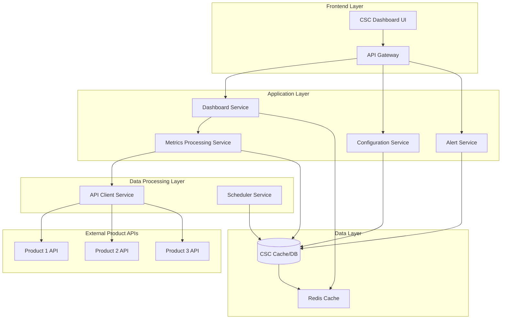
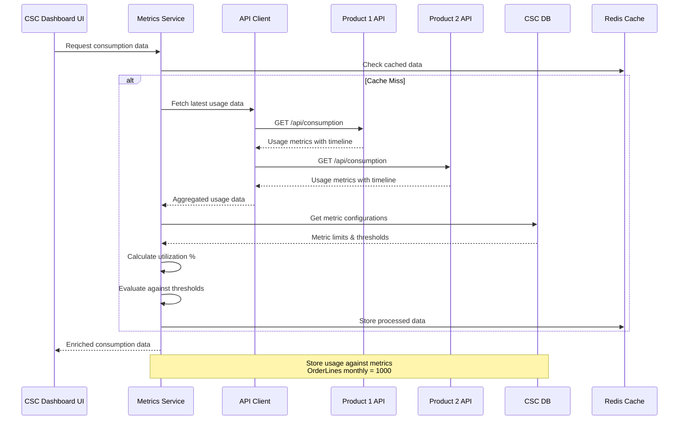

# Design Document

## Overview

The Product Consumption KPI Dashboard is a real-time monitoring and analytics platform designed to track product usage against contractual commitments and service level constraints. The system provides comprehensive visibility into consumption patterns across multiple products, sites, and time periods, enabling proactive compliance management and resource optimization.

The architecture follows a microservices pattern with event-driven data processing, real-time visualization capabilities, and flexible configuration management to support diverse product requirements and consumption patterns.

## Architecture

### High-Level Architecture



### Data Flow Architecture (Based on Discussion Notes)



### Technology Stack

- **Frontend**: React/TypeScript with real-time charting libraries (Chart.js, D3.js)
- **Backend**: Node.js/Express or Python/FastAPI for REST APIs
- **Real-time Processing**: On-demand API calls with Redis caching for performance optimization
- **Primary Database**: MongoDB for configuration and operational data (no consumption metrics storage)
- **Caching**: Redis for real-time dashboard data and session management
- **Scheduling**: Cron jobs or Apache Airflow for monthly resets and aggregations

### Database Architecture Options

The system supports both document-based (MongoDB) and relational (RDBMS) database architectures:

#### Option 1: MongoDB (Document Database) - Refined Implementation

**Collections Structure (Aligned with Requirements):**
- `organizations`: Organization/customer information with realm data
- `products`: Product definitions with configuration capabilities
- `contractualCommitments`: Subscription limits and contractual agreements per product
- `serviceConstraints`: Enterprise and site-level service constraints
- `sites`: Site information for multi-site organizations
- `consumptionData`: Real-time usage data from product APIs
- `alerts`: Alert definitions, status, and history
- `apiIntegrations`: Product API configuration and authentication details

**Refined MongoDB Schema:**
```javascript
// Organizations Collection (renamed from customers for clarity)
{
  _id: ObjectId,
  organization_name: String,
  realm: String,
  realm_id: String,
  subscription_tier: String, // "enterprise", "professional", "basic"
  billing_contact: {
    name: String,
    email: String
  },
  created_at: Date,
  updated_at: Date
}

// Products Collection (enhanced to support requirement 5)
{
  _id: ObjectId,
  product_id: String,
  product_name: String,
  organization_id: ObjectId,
  product_type: String, // "saas", "platform", "service"
  status: String, // "active", "inactive", "trial"
  api_configuration: {
    endpoint: String,
    authentication_type: String,
    polling_interval: Number
  },
  created_at: Date,
  updated_at: Date
}

// Contractual Commitments Collection (requirement 2)
{
  _id: ObjectId,
  product_id: ObjectId,
  organization_id: ObjectId,
  commitment_type: String, // "subscription_limit", "peak_usage", "named_users"
  metric_name: String, // "order_lines", "named_users", "locations"
  limit_value: Number,
  unit: String, // "count", "gb", "requests"
  reset_frequency: String, // "monthly", "yearly", "never"
  reset_day: Number, // 1 for 1st of month
  is_negotiable: Boolean, // false for contractual commitments
  contract_reference: String,
  effective_date: Date,
  expiry_date: Date,
  created_at: Date,
  updated_at: Date
}

// Service Constraints Collection (requirement 3)
{
  _id: ObjectId,
  product_id: ObjectId,
  organization_id: ObjectId,
  site_id: ObjectId, // null for enterprise-wide constraints
  constraint_type: String, // "enterprise_volume", "site_rate", "time_bound"
  constraint_name: String, // "egress_limit", "items_per_month", "requests_per_minute"
  limit_value: Number,
  unit: String,
  time_window: String, // "per_hour", "per_minute", "per_month"
  scope: String, // "enterprise", "site", "user"
  is_hard_limit: Boolean,
  created_at: Date,
  updated_at: Date
}

// Sites Collection (requirement 3 & 4)
{
  _id: ObjectId,
  site_id: String,
  site_name: String,
  organization_id: ObjectId,
  location: {
    country: String,
    region: String,
    city: String
  },
  site_type: String, // "warehouse", "office", "datacenter"
  status: String, // "active", "inactive"
  created_at: Date,
  updated_at: Date
}

// Consumption Data Collection (requirements 1, 4, 6)
// This collection stores current/latest values and metadata
{
  _id: ObjectId,
  product_id: ObjectId,
  organization_id: ObjectId,
  site_id: ObjectId, // null for organization-wide metrics
  metric_name: String,
  metric_type: String, // "contractual", "service_constraint", "kpi"
  current_value: Number,
  limit_value: Number,
  utilization_percentage: Number,
  measurement_timestamp: Date,
  
  // Metadata
  data_source: String, // API endpoint that provided this data
  data_quality: String, // "high", "medium", "low"
  last_updated: Date,
  ttl: Date // Auto-expire after certain period
}

// Time Series Data Collection (dedicated for requirement 4 - site-specific time series)
// Separate collection optimized for time series queries and site-specific data
{
  _id: ObjectId,
  product_id: ObjectId,
  organization_id: ObjectId,
  site_id: ObjectId, // Required - each document represents one site's data
  metric_name: String,
  metric_type: String,
  
  // Time series data points
  data_points: [{
    timestamp: Date,
    value: Number,
    limit_value: Number, // Limit at this point in time (can change)
    utilization_percentage: Number,
    aggregation_level: String, // "raw", "hourly", "daily", "monthly"
    data_quality: String
  }],
  
  // Time range for this document (for efficient querying)
  time_range: {
    start_date: Date,
    end_date: Date,
    granularity: String // "hourly", "daily", "monthly"
  },
  
  // Site-specific metadata
  site_metadata: {
    site_name: String,
    site_type: String,
    location: {
      country: String,
      region: String,
      city: String
    }
  },
  
  // Indexing and partitioning hints
  partition_key: String, // "2024-01" for monthly partitions
  created_at: Date,
  updated_at: Date,
  ttl: Date // Auto-expire old time series data
}

// Site Metric Configuration Collection
// Defines which metrics are tracked per site and their specific configurations
{
  _id: ObjectId,
  site_id: ObjectId,
  product_id: ObjectId,
  organization_id: ObjectId,
  
  // Site-specific metric configurations
  metrics: [{
    metric_name: String,
    metric_type: String,
    is_enabled: Boolean,
    collection_frequency: String, // "1m", "5m", "1h"
    retention_period: String, // "30d", "90d", "1y"
    
    // Site-specific limits (can override organization defaults)
    site_specific_limits: {
      limit_value: Number,
      warning_threshold: Number,
      critical_threshold: Number,
      time_window: String
    },
    
    // Aggregation rules for this site
    aggregation_rules: [{
      level: String, // "hourly", "daily", "monthly"
      method: String, // "sum", "average", "max", "min"
      retention: String // How long to keep aggregated data
    }]
  }],
  
  created_at: Date,
  updated_at: Date
}

// Alerts Collection (requirement 7)
{
  _id: ObjectId,
  product_id: ObjectId,
  organization_id: ObjectId,
  site_id: ObjectId, // null for organization-wide alerts
  alert_type: String, // "threshold_warning", "threshold_critical", "limit_exceeded"
  severity: String, // "low", "medium", "high", "critical"
  metric_name: String,
  current_value: Number,
  threshold_value: Number,
  limit_value: Number,
  message: String,
  actionable_info: String, // What user can do about it
  status: String, // "active", "acknowledged", "resolved", "auto_resolved"
  
  // Alert lifecycle
  triggered_at: Date,
  acknowledged_at: Date,
  acknowledged_by: String,
  resolved_at: Date,
  resolved_by: String,
  auto_resolve_after: Date,
  
  // Notification tracking
  notifications_sent: [{
    channel: String, // "email", "slack", "webhook"
    sent_at: Date,
    status: String // "sent", "failed", "pending"
  }],
  
  created_at: Date,
  updated_at: Date
}

// API Integrations Collection
{
  _id: ObjectId,
  product_id: ObjectId,
  integration_name: String,
  api_endpoint: String,
  authentication: {
    type: String, // "api_key", "oauth", "basic"
    credentials: Object // Encrypted credentials
  },
  polling_config: {
    interval_minutes: Number,
    timeout_seconds: Number,
    retry_attempts: Number
  },
  data_mapping: {
    metric_mappings: [{
      api_field: String,
      internal_metric: String,
      transformation: String // "direct", "sum", "average", "max"
    }]
  },
  health_status: String, // "healthy", "degraded", "failed"
  last_successful_sync: Date,
  last_error: String,
  enabled: Boolean,
  created_at: Date,
  updated_at: Date
}
```

**Benefits of MongoDB:**
- Native support for timeline data structures
- Flexible schema for different metric types
- Built-in TTL for usage data cleanup
- Aggregation pipeline for complex analytics
- Horizontal scaling capabilities

#### Option 2: RDBMS (PostgreSQL/MySQL) - Refined Implementation

**Table Structure (Aligned with Enhanced Requirements):**
```sql
-- Organizations Table (renamed from customers for clarity)
CREATE TABLE organizations (
    id SERIAL PRIMARY KEY,
    organization_name VARCHAR(255) NOT NULL,
    realm VARCHAR(255),
    realm_id VARCHAR(255),
    subscription_tier VARCHAR(50) CHECK (subscription_tier IN ('enterprise', 'professional', 'basic')),
    billing_contact_name VARCHAR(255),
    billing_contact_email VARCHAR(255),
    created_at TIMESTAMP DEFAULT CURRENT_TIMESTAMP,
    updated_at TIMESTAMP DEFAULT CURRENT_TIMESTAMP
);

-- Products Table (enhanced to support requirement 5)
CREATE TABLE products (
    id SERIAL PRIMARY KEY,
    product_id VARCHAR(255) UNIQUE NOT NULL,
    product_name VARCHAR(255) NOT NULL,
    organization_id INTEGER REFERENCES organizations(id),
    product_type VARCHAR(50) CHECK (product_type IN ('saas', 'platform', 'service')),
    status VARCHAR(50) CHECK (status IN ('active', 'inactive', 'trial')),
    api_endpoint VARCHAR(500),
    authentication_type VARCHAR(100),
    polling_interval INTEGER,
    created_at TIMESTAMP DEFAULT CURRENT_TIMESTAMP,
    updated_at TIMESTAMP DEFAULT CURRENT_TIMESTAMP
);

-- Sites Table (requirement 3 & 4 - multi-site support)
CREATE TABLE sites (
    id SERIAL PRIMARY KEY,
    site_id VARCHAR(255) UNIQUE NOT NULL,
    site_name VARCHAR(255) NOT NULL,
    organization_id INTEGER REFERENCES organizations(id),
    country VARCHAR(100),
    region VARCHAR(100),
    city VARCHAR(100),
    site_type VARCHAR(50) CHECK (site_type IN ('warehouse', 'office', 'datacenter')),
    status VARCHAR(50) CHECK (status IN ('active', 'inactive')),
    created_at TIMESTAMP DEFAULT CURRENT_TIMESTAMP,
    updated_at TIMESTAMP DEFAULT CURRENT_TIMESTAMP
);

-- Contractual Commitments Table (requirement 2)
CREATE TABLE contractual_commitments (
    id SERIAL PRIMARY KEY,
    product_id INTEGER REFERENCES products(id),
    organization_id INTEGER REFERENCES organizations(id),
    commitment_type VARCHAR(100),
    metric_name VARCHAR(255) NOT NULL,
    limit_value BIGINT NOT NULL,
    unit VARCHAR(50),
    reset_frequency VARCHAR(50) CHECK (reset_frequency IN ('monthly', 'yearly', 'never')),
    reset_day INTEGER DEFAULT 1,
    is_negotiable BOOLEAN DEFAULT FALSE,
    contract_reference VARCHAR(255),
    effective_date DATE,
    expiry_date DATE,
    created_at TIMESTAMP DEFAULT CURRENT_TIMESTAMP,
    updated_at TIMESTAMP DEFAULT CURRENT_TIMESTAMP
);

-- Service Constraints Table (requirement 3)
CREATE TABLE service_constraints (
    id SERIAL PRIMARY KEY,
    product_id INTEGER REFERENCES products(id),
    organization_id INTEGER REFERENCES organizations(id),
    site_id INTEGER REFERENCES sites(id), -- NULL for enterprise-wide constraints
    constraint_type VARCHAR(100),
    constraint_name VARCHAR(255) NOT NULL,
    limit_value BIGINT NOT NULL,
    unit VARCHAR(50),
    time_window VARCHAR(100),
    scope VARCHAR(50) CHECK (scope IN ('enterprise', 'site', 'user')),
    is_hard_limit BOOLEAN DEFAULT TRUE,
    created_at TIMESTAMP DEFAULT CURRENT_TIMESTAMP,
    updated_at TIMESTAMP DEFAULT CURRENT_TIMESTAMP
);

-- Site Metric Configurations Table
CREATE TABLE site_metric_configurations (
    id SERIAL PRIMARY KEY,
    site_id INTEGER REFERENCES sites(id),
    product_id INTEGER REFERENCES products(id),
    organization_id INTEGER REFERENCES organizations(id),
    metric_name VARCHAR(255) NOT NULL,
    metric_type VARCHAR(100),
    is_enabled BOOLEAN DEFAULT TRUE,
    collection_frequency VARCHAR(50), -- "1m", "5m", "1h"
    retention_period VARCHAR(50), -- "30d", "90d", "1y"
    
    -- Site-specific limits (can override organization defaults)
    site_limit_value BIGINT,
    warning_threshold DECIMAL(5,2),
    critical_threshold DECIMAL(5,2),
    time_window VARCHAR(100),
    
    created_at TIMESTAMP DEFAULT CURRENT_TIMESTAMP,
    updated_at TIMESTAMP DEFAULT CURRENT_TIMESTAMP,
    
    UNIQUE(site_id, product_id, metric_name)
);

-- Consumption Data Table (requirements 1, 6 - current/latest values)
CREATE TABLE consumption_data (
    id SERIAL PRIMARY KEY,
    product_id INTEGER REFERENCES products(id),
    organization_id INTEGER REFERENCES organizations(id),
    site_id INTEGER REFERENCES sites(id), -- NULL for organization-wide metrics
    metric_name VARCHAR(255) NOT NULL,
    metric_type VARCHAR(100),
    current_value BIGINT NOT NULL,
    limit_value BIGINT NOT NULL,
    utilization_percentage DECIMAL(5,2),
    measurement_timestamp TIMESTAMP NOT NULL,
    
    -- Metadata
    data_source VARCHAR(500),
    data_quality VARCHAR(50) CHECK (data_quality IN ('high', 'medium', 'low')),
    last_updated TIMESTAMP DEFAULT CURRENT_TIMESTAMP,
    
    -- Indexing for efficient queries
    INDEX idx_consumption_org_product (organization_id, product_id),
    INDEX idx_consumption_site_metric (site_id, metric_name),
    INDEX idx_consumption_timestamp (measurement_timestamp)
);

-- Time Series Data Table (requirement 4 - dedicated for site-specific time series)
-- Partitioned by time for optimal performance
CREATE TABLE time_series_data (
    id BIGSERIAL,
    product_id INTEGER REFERENCES products(id),
    organization_id INTEGER REFERENCES organizations(id),
    site_id INTEGER REFERENCES sites(id) NOT NULL, -- Required for site-specific data
    metric_name VARCHAR(255) NOT NULL,
    metric_type VARCHAR(100),
    
    -- Time series data point
    timestamp TIMESTAMP NOT NULL,
    value BIGINT NOT NULL,
    limit_value BIGINT NOT NULL,
    utilization_percentage DECIMAL(5,2),
    aggregation_level VARCHAR(50) CHECK (aggregation_level IN ('raw', 'hourly', 'daily', 'monthly')),
    data_quality VARCHAR(50) CHECK (data_quality IN ('high', 'medium', 'low')),
    
    -- Time range metadata for efficient querying
    time_range_start DATE NOT NULL,
    time_range_end DATE NOT NULL,
    granularity VARCHAR(50),
    
    -- Partitioning key
    partition_key VARCHAR(20) NOT NULL, -- "2024-01" for monthly partitions
    
    created_at TIMESTAMP DEFAULT CURRENT_TIMESTAMP,
    
    -- Primary key includes partition key for efficient partitioning
    PRIMARY KEY (id, partition_key, timestamp)
) PARTITION BY RANGE (timestamp);

-- Create monthly partitions for time series data (example)
CREATE TABLE time_series_data_2024_01 PARTITION OF time_series_data
    FOR VALUES FROM ('2024-01-01') TO ('2024-02-01');

CREATE TABLE time_series_data_2024_02 PARTITION OF time_series_data
    FOR VALUES FROM ('2024-02-01') TO ('2024-03-01');

-- Indexes for time series queries
CREATE INDEX idx_time_series_site_metric_time 
    ON time_series_data (site_id, metric_name, timestamp);

CREATE INDEX idx_time_series_org_time 
    ON time_series_data (organization_id, timestamp);

CREATE INDEX idx_time_series_product_time 
    ON time_series_data (product_id, timestamp);

-- Aggregation Rules Table (for site-specific aggregation configurations)
CREATE TABLE aggregation_rules (
    id SERIAL PRIMARY KEY,
    site_id INTEGER REFERENCES sites(id),
    metric_name VARCHAR(255) NOT NULL,
    aggregation_level VARCHAR(50) CHECK (aggregation_level IN ('hourly', 'daily', 'monthly')),
    aggregation_method VARCHAR(50) CHECK (aggregation_method IN ('sum', 'average', 'max', 'min')),
    retention_period VARCHAR(50), -- How long to keep aggregated data
    is_enabled BOOLEAN DEFAULT TRUE,
    created_at TIMESTAMP DEFAULT CURRENT_TIMESTAMP,
    updated_at TIMESTAMP DEFAULT CURRENT_TIMESTAMP,
    
    UNIQUE(site_id, metric_name, aggregation_level)
);

-- Alerts Table (requirement 7 - enhanced alerting)
CREATE TABLE alerts (
    id SERIAL PRIMARY KEY,
    product_id INTEGER REFERENCES products(id),
    organization_id INTEGER REFERENCES organizations(id),
    site_id INTEGER REFERENCES sites(id), -- NULL for organization-wide alerts
    alert_type VARCHAR(100),
    severity VARCHAR(50) CHECK (severity IN ('low', 'medium', 'high', 'critical')),
    metric_name VARCHAR(255) NOT NULL,
    current_value BIGINT,
    threshold_value BIGINT,
    limit_value BIGINT,
    message TEXT,
    actionable_info TEXT,
    status VARCHAR(50) CHECK (status IN ('active', 'acknowledged', 'resolved', 'auto_resolved')),
    
    -- Alert lifecycle
    triggered_at TIMESTAMP NOT NULL,
    acknowledged_at TIMESTAMP,
    acknowledged_by VARCHAR(255),
    resolved_at TIMESTAMP,
    resolved_by VARCHAR(255),
    auto_resolve_after TIMESTAMP,
    
    created_at TIMESTAMP DEFAULT CURRENT_TIMESTAMP,
    updated_at TIMESTAMP DEFAULT CURRENT_TIMESTAMP,
    
    -- Indexes for alert queries
    INDEX idx_alerts_org_status (organization_id, status),
    INDEX idx_alerts_site_status (site_id, status),
    INDEX idx_alerts_triggered (triggered_at)
);

-- Alert Notifications Table (tracking notification delivery)
CREATE TABLE alert_notifications (
    id SERIAL PRIMARY KEY,
    alert_id INTEGER REFERENCES alerts(id),
    channel VARCHAR(50) CHECK (channel IN ('email', 'slack', 'webhook')),
    sent_at TIMESTAMP NOT NULL,
    status VARCHAR(50) CHECK (status IN ('sent', 'failed', 'pending')),
    error_message TEXT,
    created_at TIMESTAMP DEFAULT CURRENT_TIMESTAMP
);

-- API Integrations Table
CREATE TABLE api_integrations (
    id SERIAL PRIMARY KEY,
    product_id INTEGER REFERENCES products(id),
    integration_name VARCHAR(255) NOT NULL,
    api_endpoint VARCHAR(500) NOT NULL,
    authentication_type VARCHAR(100),
    authentication_config JSONB, -- Encrypted credentials
    
    -- Polling configuration
    polling_interval_minutes INTEGER DEFAULT 5,
    timeout_seconds INTEGER DEFAULT 30,
    retry_attempts INTEGER DEFAULT 3,
    
    -- Data mapping configuration
    metric_mappings JSONB, -- Array of mapping configurations
    
    -- Health and status
    health_status VARCHAR(50) CHECK (health_status IN ('healthy', 'degraded', 'failed')),
    last_successful_sync TIMESTAMP,
    last_error TEXT,
    enabled BOOLEAN DEFAULT TRUE,
    
    created_at TIMESTAMP DEFAULT CURRENT_TIMESTAMP,
    updated_at TIMESTAMP DEFAULT CURRENT_TIMESTAMP
);
```

**Benefits of RDBMS:**
- ACID compliance for data consistency and financial accuracy
- Strong referential integrity ensures data relationships are maintained
- Mature tooling and monitoring ecosystem
- SQL query capabilities for complex analytics and reporting
- Better support for complex joins across organizations, products, sites, and metrics
- Native partitioning support for time series data performance
- Efficient indexing strategies for site-specific queries
- Built-in constraint validation for data quality
- Standardized backup and recovery procedures

**Challenges with RDBMS:**
- More complex schema design for flexible metric configurations
- Schema migrations needed when adding new metric types or visualization options
- JSON columns for API response mapping reduce some relational benefits
- Partitioning setup complexity for optimal time-series performance
- Less flexible for varying product-specific metric structures
- Horizontal scaling requires more planning and configuration
- Timeline data normalization requires additional processing logic

#### Database Recommendation

**For this specific use case, MongoDB is recommended** due to:

1. **Timeline Data Structure**: The metric_value field with embedded timeline arrays maps naturally to MongoDB documents
2. **Schema Flexibility**: Different products may have varying metric structures and timeline formats
3. **Rapid Development**: No need for schema migrations when adding new metric types or visualization configs
4. **JSON-Native**: Product API responses are JSON-based, reducing transformation overhead
5. **Aggregation Pipeline**: Complex analytics queries for dashboard data are easier with MongoDB's aggregation framework

**Consider RDBMS if:**
- Strong ACID compliance is required for financial/billing data
- Complex relational queries across multiple entities are frequent
- Existing team expertise is primarily SQL-based
- Integration with existing RDBMS-based systems is critical

### Data Sources and Consumption Data Flow

The system ingests consumption data from product teams via standardized APIs to provide comprehensive monitoring:

#### Primary Data Source

**Product Consumption APIs**
- Each product team provides a dedicated API endpoint that exposes their consumption metrics
- APIs follow a standardized contract for consistent data ingestion
- Support both real-time streaming and batch data retrieval patterns
- Include all relevant consumption metrics as defined in their contractual commitments and service constraints

#### API Contract Specification (Based on Discussion Notes)

**Product API Response Format:**
Each product API (API_1, API_2, API_3) returns consumption data in the following standardized format:

```typescript
interface ProductConsumptionAPI {
  // Get current consumption for all metrics
  getCurrentConsumption(serviceId: string): Promise<ProductAPIResponse[]>
}

// Actual API response structure from discussion notes
interface ProductAPIResponse {
  service_id: string
  metric_name: string
  value?: string | number // Can be "TIMELINE", "_TIMELINE_", or actual numeric value
  timeline?: TimelineEntry[]
}

interface TimelineEntry {
  duration: string // "Month"
  start: number
  end: number
  value: number
}
```

**Example API Response (from discussion notes):**
```json
[
  {
    "service_id": "1004560000",
    "metric_name": "Average Order Lines",
    "timeline": [
      {
        "duration": "Month",
        "start": 6,
        "end": 16,
        "value": 400000
      },
      {
        "duration": "Month",
        "start": 17,
        "end": 18,
        "value": 500000
      },
      {
        "duration": "Month",
        "start": 19,
        "end": 31,
        "value": 600000
      },
      {
        "duration": "Month",
        "start": 32,
        "end": 36,
        "value": 1000000
      },
      {
        "duration": "Month",
        "start": 37,
        "end": 42,
        "value": 1300000
      },
      {
        "duration": "Month",
        "start": 43,
        "end": 53,
        "value": 2000000
      },
      {
        "duration": "Month",
        "start": 54,
        "end": 84,
        "value": 2500000
      }
    ]
  },
  {
    "service_id": "1004560000",
    "metric_name": "Locations",
    "value": "TIMELINE",
    "timeline": [
      {
        "duration": "Month",
        "start": 6,
        "end": 16,
        "value": 1
      },
      {
        "duration": "Month",
        "start": 17,
        "end": 18,
        "value": 2
      },
      {
        "duration": "Month",
        "start": 19,
        "end": 31,
        "value": 3
      },
      {
        "duration": "Month",
        "start": 32,
        "end": 36,
        "value": 4
      },
      {
        "duration": "Month",
        "start": 37,
        "end": 42,
        "value": 5
      },
      {
        "duration": "Month",
        "start": 43,
        "end": 53,
        "value": 6
      },
      {
        "duration": "Month",
        "start": 54,
        "end": 84,
        "value": 7
      }
    ]
  },
  {
    "service_id": "1004560000",
    "metric_name": "Max concurrent UI users",
    "value": "30"
  }
]
```

**API Response Patterns:**
1. **Timeline Metrics**: Include `timeline` array with historical data points
2. **Static Metrics**: Include simple `value` field with current value
3. **Mixed Format**: Some metrics may have both `value` and `timeline` fields

#### Enhanced Data Processing for UI Optimization

**Data Normalization Layer:**
To ensure consistent UI rendering, all API responses are normalized through a processing layer that maintains the original design's flexibility:

```typescript
// Enhanced metric with original design's display configuration
interface EnhancedMetric {
  // Core data from discussion schema
  metric_id: string
  service_id: string
  customer_id: string
  metric_type: 'Contractual' | 'Enterprise' | 'Site'
  metric_name: string
  metric_value: MetricValue
  
  // Original design's flexible display configuration
  displayConfig: MetricDisplayConfig
  
  // Processed data for UI
  processedData: {
    current_value: number
    display_value: string
    unit: string
    timeline_data?: ProcessedTimelineEntry[]
    utilization_percentage?: number
    status: 'healthy' | 'warning' | 'critical'
    trend: TrendAnalysis
  }
  
  // Metadata
  metadata: {
    last_updated: Date
    data_source: string
    confidence_level: 'high' | 'medium' | 'low'
  }
}

// Restored original design's flexible display configuration
interface MetricDisplayConfig {
  displayName: string
  description?: string
  category: string
  visualizationType: 'gauge' | 'progress_bar' | 'counter' | 'chart' | 'table' | 'timeline_chart' | 'heatmap'
  formatType: 'number' | 'percentage' | 'currency' | 'bytes' | 'duration' | 'custom'
  customFormat?: string
  thresholds: {
    warning: number
    critical: number
  }
  icon?: string
  color?: string
  priority: number
  
  // Enhanced for timeline support
  timelineConfig?: {
    defaultTimeRange: 'last_30_days' | 'last_90_days' | 'last_year' | 'all_time'
    aggregationLevel: 'daily' | 'weekly' | 'monthly' | 'quarterly'
    showTrend: boolean
    showProjection: boolean
  }
}

interface ProcessedTimelineEntry {
  period: string // "2024-01", "2024-Q1", etc.
  period_start: Date
  period_end: Date
  value: number
  formatted_value: string
  trend: 'up' | 'down' | 'stable'
  percentage_change?: number
}

interface TrendAnalysis {
  direction: 'increasing' | 'decreasing' | 'stable'
  percentage_change: number
  period: string
  confidence: 'high' | 'medium' | 'low'
  projection?: {
    next_period_estimate: number
    time_to_limit?: string
  }
}
```

**Data Processing Pipeline:**
1. **API Response Validation**: Validate incoming data structure and handle missing fields
2. **Timeline Normalization**: Convert timeline entries to consistent date ranges
3. **Value Calculation**: Calculate current values from timeline data when needed
4. **Trend Analysis**: Compute trends and percentage changes for UI indicators
5. **Formatting**: Apply appropriate number formatting based on metric type
6. **Caching**: Store processed data with appropriate TTL for performance

#### UI-Optimized Data Structures

**Dashboard View Models:**
```typescript
interface DashboardViewModel {
  customer_info: {
    name: string
    realm: string
    total_services: number
  }
  overview_metrics: {
    total_metrics: number
    critical_alerts: number
    warning_alerts: number
    healthy_metrics: number
  }
  service_cards: ServiceCardViewModel[]
  alert_summary: AlertSummaryViewModel
  last_updated: Date
}

interface ServiceCardViewModel {
  service_id: string
  product_name: string
  status: 'healthy' | 'warning' | 'critical'
  metrics_count: number
  critical_metrics: MetricCardViewModel[]
  utilization_summary: {
    average_utilization: number
    highest_utilization: number
    trending_up_count: number
  }
}

interface MetricCardViewModel {
  metric_name: string
  display_name: string
  current_value: number
  formatted_value: string
  limit_value: number
  formatted_limit: string
  utilization_percentage: number
  status: 'healthy' | 'warning' | 'critical'
  trend: {
    direction: 'up' | 'down' | 'stable'
    percentage_change: number
    period: string
  }
  visualization: {
    type: 'gauge' | 'progress_bar' | 'counter' | 'chart'
    color: string
    icon: string
    chart_data?: ChartDataPoint[]
  }
  alert_info?: {
    threshold_breached: boolean
    time_to_limit: string
    recommended_action: string
  }
}

interface ChartDataPoint {
  timestamp: Date
  value: number
  formatted_value: string
  limit: number
  utilization: number
}
```

**Error Handling for UI:**
```typescript
interface UIErrorState {
  type: 'loading' | 'error' | 'no_data' | 'partial_data'
  message: string
  user_friendly_message: string
  retry_available: boolean
  fallback_data?: any
  error_code?: string
}

interface DataLoadingState {
  is_loading: boolean
  loaded_services: string[]
  failed_services: string[]
  partial_failures: PartialFailure[]
  estimated_completion: Date
}

interface PartialFailure {
  service_id: string
  metric_name: string
  error_message: string
  fallback_value?: number
  last_successful_update: Date
}
```

#### Real-World Production Considerations

**Performance Optimization:**
```typescript
interface CachingStrategy {
  // Multi-level caching for optimal performance
  levels: {
    browser: {
      duration: number // 30 seconds for real-time data
      storage: 'memory' | 'localStorage'
    }
    redis: {
      duration: number // 5 minutes for processed metrics
      key_pattern: string
    }
    database: {
      indexes: string[]
      query_optimization: boolean
    }
  }
  
  // Cache invalidation strategies
  invalidation: {
    time_based: boolean
    event_based: string[] // API updates, config changes
    manual_refresh: boolean
  }
}

interface DataFreshness {
  real_time_threshold: number // 2 minutes
  stale_data_threshold: number // 15 minutes
  fallback_strategy: 'cached' | 'estimated' | 'unavailable'
  user_notification: {
    show_staleness_indicator: boolean
    auto_refresh_interval: number
  }
}
```

**Scalability Considerations:**
```typescript
interface ScalabilityConfig {
  // Handle multiple customers and high data volume
  data_partitioning: {
    strategy: 'customer_based' | 'time_based' | 'hybrid'
    partition_size: number
    retention_policy: {
      usage_data: string // "30 days"
      alert_history: string // "1 year"
      configuration_history: string // "5 years"
    }
  }
  
  // API rate limiting and throttling
  rate_limiting: {
    per_customer: number // requests per minute
    per_service: number
    burst_allowance: number
    backoff_strategy: 'exponential' | 'linear'
  }
  
  // Load balancing for high availability
  load_balancing: {
    api_endpoints: boolean
    database_reads: boolean
    cache_distribution: boolean
  }
}
```

**Security and Compliance:**
```typescript
interface SecurityConfig {
  // Data access controls
  access_control: {
    customer_isolation: boolean // Strict customer data separation
    role_based_access: {
      admin: string[]
      viewer: string[]
      customer_specific: string[]
    }
    api_authentication: {
      internal_services: 'jwt' | 'api_key'
      external_apis: 'oauth' | 'api_key'
      token_rotation: boolean
    }
  }
  
  // Data privacy and compliance
  privacy: {
    data_anonymization: boolean
    audit_logging: boolean
    gdpr_compliance: {
      data_retention: string
      deletion_requests: boolean
      consent_tracking: boolean
    }
  }
  
  // Network security
  network_security: {
    api_encryption: 'tls_1_3'
    internal_communication: 'encrypted'
    firewall_rules: string[]
  }
}
```

**Monitoring and Observability:**
```typescript
interface MonitoringConfig {
  // Application performance monitoring
  apm: {
    response_time_tracking: boolean
    error_rate_monitoring: boolean
    throughput_metrics: boolean
    custom_business_metrics: string[]
  }
  
  // Health checks and alerting
  health_checks: {
    api_endpoints: {
      interval: number // seconds
      timeout: number
      failure_threshold: number
    }
    database_connectivity: {
      interval: number
      query_performance: boolean
    }
    external_api_health: {
      product_apis: string[]
      degraded_service_handling: boolean
    }
  }
  
  // Logging strategy
  logging: {
    structured_logging: boolean
    log_levels: {
      production: 'warn' | 'error'
      development: 'debug' | 'info'
    }
    correlation_ids: boolean
    sensitive_data_masking: boolean
  }
}
```

**User Experience Enhancements:**
```typescript
interface UXEnhancements {
  // Progressive loading for better perceived performance
  progressive_loading: {
    skeleton_screens: boolean
    lazy_loading: boolean
    priority_metrics: string[] // Load critical metrics first
  }
  
  // Responsive design and accessibility
  responsive_design: {
    breakpoints: {
      mobile: string
      tablet: string
      desktop: string
    }
    touch_friendly: boolean
    keyboard_navigation: boolean
  }
  
  // Accessibility compliance
  accessibility: {
    wcag_level: 'AA' | 'AAA'
    screen_reader_support: boolean
    high_contrast_mode: boolean
    keyboard_shortcuts: Record<string, string>
  }
  
  // Internationalization
  i18n: {
    supported_languages: string[]
    number_formatting: boolean // Locale-specific number formats
    date_formatting: boolean
    rtl_support: boolean
  }
  
  // User preferences and customization
  personalization: {
    dashboard_layout: 'customizable' | 'fixed'
    metric_preferences: boolean
    notification_settings: boolean
    theme_selection: string[]
  }
}
```

**Data Quality and Validation:**
```typescript
interface DataQualityConfig {
  // Input validation for API responses
  validation_rules: {
    required_fields: string[]
    data_type_validation: boolean
    range_validation: {
      min_values: Record<string, number>
      max_values: Record<string, number>
    }
    timeline_consistency: boolean // Ensure timeline data is sequential
  }
  
  // Data anomaly detection
  anomaly_detection: {
    sudden_spikes: {
      threshold_percentage: number
      alert_on_anomaly: boolean
    }
    missing_data_detection: boolean
    data_freshness_monitoring: boolean
  }
  
  // Data reconciliation
  reconciliation: {
    cross_api_validation: boolean // Compare data across different product APIs
    historical_consistency: boolean
    manual_override_capability: boolean
  }
}
```
```

#### Data Ingestion Patterns

The system supports flexible ingestion patterns to accommodate different product team capabilities:

```typescript
interface ProductAPIIngestionStrategy {
  // Polling-based ingestion for products with REST APIs
  pollingIngestion: {
    endpoint: string
    schedule: 'every_minute' | 'every_5_minutes' | 'hourly'
    authentication: APIAuthentication
  }
  
  // Webhook-based ingestion for real-time updates
  webhookIngestion: {
    webhookUrl: string
    authentication: WebhookAuthentication
    retryPolicy: RetryPolicy
  }
  
  // Streaming ingestion for high-volume products
  streamingIngestion: {
    streamEndpoint: string
    protocol: 'websocket' | 'server-sent-events'
    authentication: StreamAuthentication
  }
}
```

#### Real-Time Data Flow Architecture

1. **API Integration Layer**: Connects to product team APIs on-demand for real-time consumption data
2. **Data Validation Layer**: Validates incoming consumption data against API contracts
3. **Enrichment Layer**: Combines raw consumption data with configuration limits and constraints
4. **Caching Layer**: Redis provides short-term caching for frequently accessed data to improve performance
5. **Alert Processing Layer**: Evaluates consumption data against thresholds and generates alerts
6. **Serving Layer**: Dashboard APIs serve enriched consumption data directly to the UI

**Benefits of Real-Time Approach:**
- **Simplified Architecture**: No need for complex stream processing or data storage pipelines
- **Always Fresh Data**: Consumption data is always current from the source systems
- **Reduced Storage Costs**: No need to store large volumes of historical consumption data
- **Lower Maintenance**: Fewer moving parts and data synchronization concerns
- **Faster Development**: Simpler implementation without data ingestion complexity

#### Product Team Integration Requirements

**API Standards:**
- RESTful endpoints following OpenAPI 3.0 specification
- Consistent data formats using standardized consumption metric schema
- Authentication via API keys or OAuth 2.0
- Rate limiting and error handling best practices

**Data Delivery Options:**
- **Pull Model**: Dashboard polls product APIs on configurable schedules
- **Push Model**: Product teams send consumption data via webhooks
- **Hybrid Model**: Real-time updates via webhooks, historical data via polling

#### Distinction: Product Consumption APIs vs Metrics Service

**Product Consumption APIs (External - Provided by Product Teams):**
- **Purpose**: Data source that exposes raw consumption data from individual products
- **Ownership**: Each product team owns and maintains their own API
- **Responsibility**: Provide current consumption values (e.g., "we've processed 5.2M order lines today")
- **Data Format**: Raw consumption numbers without context of limits or thresholds
- **Examples**: 
  - `GET /api/consumption` → `{"orderLines": 5200000, "activeUsers": 1850, "warehouses": 4}`
  - Product-specific metrics in their native units and formats

**Metrics Service (Internal - Part of Dashboard System):**
- **Purpose**: Business logic layer that processes and enriches consumption data
- **Ownership**: Dashboard development team owns and maintains this service
- **Responsibility**: 
  - Fetch data from multiple Product Consumption APIs
  - Apply business rules and calculations
  - Compare consumption against configured limits
  - Calculate utilization percentages and trends
  - Generate derived metrics and aggregations
- **Data Format**: Enriched consumption data with context, limits, and calculated insights
- **Examples**:
  - Takes raw `{"orderLines": 5200000}` from Product API
  - Combines with limit configuration `{"orderLinesLimit": 11000000}`
  - Returns enriched data: `{"orderLines": 5200000, "limit": 11000000, "utilization": 47.3%, "status": "normal", "trend": "increasing"}`

**Data Flow Example:**
```
Product API → Raw Data: {"orderLines": 5200000}
     ↓
Metrics Service → Enriched Data: {
  "orderLines": 5200000,
  "limit": 11000000,
  "utilization": 47.3%,
  "status": "normal",
  "trend": "increasing",
  "timeToLimit": "45 days",
  "alertThreshold": 80%
}
     ↓
Dashboard UI → Visual representation with charts and alerts
```

## Components and Interfaces

### 1. Dashboard Service

**Responsibilities:**
- Serve dashboard UI and aggregate consumption data
- Handle real-time data updates via WebSocket connections
- Manage user sessions and filtering preferences

**Key Interfaces:**
```typescript
interface DashboardService {
  getProductOverview(): Promise<ProductOverview[]>
  getConsumptionMetrics(productId: string, timeRange: TimeRange): Promise<ConsumptionMetrics>
  getTimeSeriesData(siteIds: string[], timeRange: TimeRange): Promise<TimeSeriesData>
  subscribeToRealTimeUpdates(callback: (data: ConsumptionUpdate) => void): void
}
```

### 2. Configuration Service

**Responsibilities:**
- Manage customer, service, and metric configurations based on discussion schema
- Handle CRUD operations for metric display configurations and thresholds
- Validate configuration changes and ensure data integrity
- Support dynamic schema evolution for diverse product requirements

**Key Interfaces:**
```typescript
interface ConfigurationService {
  // Customer management
  getCustomer(customerId: string): Promise<Customer>
  createCustomer(customer: Omit<Customer, 'id' | 'created_at' | 'updated_at'>): Promise<string>
  
  // Service management
  getService(serviceId: string): Promise<Service>
  getServicesByCustomer(customerId: string): Promise<Service[]>
  createService(service: Omit<Service, 'id' | 'created_at' | 'updated_at'>): Promise<string>
  
  // Metric configuration management
  getMetric(metricId: string): Promise<Metric>
  getMetricsByService(serviceId: string): Promise<Metric[]>
  createMetric(metric: Omit<Metric, 'id' | 'created_at' | 'updated_at'>): Promise<string>
  updateMetricDisplayConfig(metricId: string, displayConfig: MetricDisplayConfig): Promise<void>
  
  // MAC metadata management
  getMACMetadata(customerId: string): Promise<MACMetadata>
  updateMACMetadata(customerId: string, metadata: Partial<MACMetadata>): Promise<void>
  
  // API integration configuration
  getAPIIntegration(productName: string): Promise<APIIntegration>
  updateAPIIntegration(integration: APIIntegration): Promise<void>
  
  // Configuration validation and history
  validateConfiguration(config: any): Promise<ValidationResult>
  getConfigurationHistory(entityId: string, entityType: string): Promise<ConfigurationHistory[]>
}
```

### 3. Metrics Service (Enhanced with Site-Specific Time Series Support)

**Responsibilities:**
- Fetch and aggregate consumption data from product APIs on-demand
- Process timeline data and calculate current values for each site
- Enrich raw API data with configuration and display settings
- Handle complex data enrichment and business logic calculations
- Manage site-specific time series data storage and retrieval

**Key Interfaces:**
```typescript
interface MetricsService {
  // Core data fetching
  getCurrentConsumption(productId: string, organizationId: string): Promise<EnhancedMetric[]>
  getMetricsByOrganization(organizationId: string): Promise<EnhancedMetric[]>
  getMetricsBySite(siteId: string): Promise<EnhancedMetric[]>
  
  // Site-specific time series data (requirement 4)
  getSiteTimeSeriesData(siteId: string, metricName: string, timeRange: TimeRange): Promise<TimeSeriesData>
  getMultipleSitesTimeSeriesData(siteIds: string[], metricName: string, timeRange: TimeRange): Promise<TimeSeriesData[]>
  compareSitesMetrics(siteIds: string[], metricNames: string[], timeRange: TimeRange): Promise<SiteComparisonData>
  
  // Data processing and enrichment
  processProductAPIResponse(apiResponse: ProductAPIResponse[], productId: string): Promise<EnhancedMetric[]>
  calculateUtilizationPercentage(current: number, limit: number | TimelineEntry[]): number
  extractCurrentValueFromTimeline(timeline: TimelineEntry[]): number
  
  // Timeline data processing
  normalizeTimelineData(timeline: TimelineEntry[]): ProcessedTimelineEntry[]
  calculateTrendAnalysis(timeline: ProcessedTimelineEntry[]): TrendAnalysis
  
  // Site-specific data management
  storeSiteTimeSeriesData(siteId: string, metricName: string, dataPoints: TimeSeriesPoint[]): Promise<void>
  aggregateSiteData(siteId: string, metricName: string, aggregationLevel: 'hourly' | 'daily' | 'monthly'): Promise<void>
  
  // Aggregation and analytics
  getAggregatedMetrics(filters: MetricFilters): Promise<AggregatedMetrics>
  getDashboardViewModel(organizationId: string): Promise<DashboardViewModel>
  getSiteDashboardViewModel(siteId: string): Promise<SiteDashboardViewModel>
}

interface SiteComparisonData {
  metric_name: string
  time_range: TimeRange
  sites: SiteMetricComparison[]
  aggregated_stats: {
    total_across_sites: number
    average_per_site: number
    highest_consuming_site: string
    lowest_consuming_site: string
  }
}

interface SiteMetricComparison {
  site_id: string
  site_name: string
  current_value: number
  utilization_percentage: number
  trend: TrendAnalysis
  time_series_data: ProcessedTimelineEntry[]
}

interface SiteDashboardViewModel {
  site_info: {
    site_id: string
    site_name: string
    location: {
      country: string
      region: string
      city: string
    }
    site_type: string
  }
  metrics: MetricCardViewModel[]
  time_series_charts: TimeSeriesChartViewModel[]
  alerts: AlertViewModel[]
  last_updated: Date
}

interface TimeSeriesChartViewModel {
  metric_name: string
  chart_type: 'line' | 'area' | 'bar'
  data_points: ChartDataPoint[]
  thresholds: {
    warning: number
    critical: number
  }
  aggregation_level: 'hourly' | 'daily' | 'monthly'
}
```

### 6. Site-Specific Time Series Data Management

**Responsibilities:**
- Handle site-specific time series data storage and retrieval efficiently
- Support multi-site comparisons and analytics
- Manage data partitioning and retention policies per site
- Optimize queries for time-range and site-based filtering

**Key Design Patterns:**

#### Time Series Data Partitioning Strategy
```typescript
interface TimeSeriesPartitioningStrategy {
  // Partition by time and site for optimal query performance
  partitioning_scheme: {
    primary_key: 'site_id' // Distribute data by site
    secondary_key: 'time_range.start_date' // Sub-partition by time
    partition_size: 'monthly' // Each partition covers one month
  }
  
  // Indexing strategy for efficient queries
  indexes: {
    site_metric_time: ['site_id', 'metric_name', 'time_range.start_date']
    organization_time: ['organization_id', 'time_range.start_date']
    metric_time: ['metric_name', 'time_range.start_date']
  }
  
  // Data retention per site
  retention_policies: {
    raw_data: '30_days'
    hourly_aggregates: '90_days'
    daily_aggregates: '1_year'
    monthly_aggregates: '5_years'
  }
}
```

#### Site Time Series Query Patterns
```typescript
interface SiteTimeSeriesQueries {
  // Single site time series
  getSiteMetricTimeSeries(
    siteId: string, 
    metricName: string, 
    timeRange: TimeRange,
    aggregationLevel: 'raw' | 'hourly' | 'daily' | 'monthly'
  ): Promise<TimeSeriesData>
  
  // Multi-site comparison
  compareSitesTimeSeries(
    siteIds: string[], 
    metricName: string, 
    timeRange: TimeRange
  ): Promise<SiteComparisonData>
  
  // Organization-wide aggregation across all sites
  getOrganizationTimeSeriesAggregation(
    organizationId: string,
    metricName: string,
    timeRange: TimeRange,
    aggregationMethod: 'sum' | 'average' | 'max' | 'min'
  ): Promise<AggregatedTimeSeriesData>
  
  // Site performance ranking
  getSitePerformanceRanking(
    organizationId: string,
    metricName: string,
    timeRange: TimeRange,
    rankingCriteria: 'highest_usage' | 'highest_utilization' | 'most_efficient'
  ): Promise<SiteRankingData[]>
}

interface AggregatedTimeSeriesData {
  organization_id: string
  metric_name: string
  time_range: TimeRange
  aggregation_method: string
  total_sites_included: number
  data_points: AggregatedDataPoint[]
}

interface AggregatedDataPoint {
  timestamp: Date
  aggregated_value: number
  site_count: number // How many sites contributed to this data point
  min_site_value: number
  max_site_value: number
  average_site_value: number
}

interface SiteRankingData {
  site_id: string
  site_name: string
  ranking_position: number
  metric_value: number
  utilization_percentage: number
  performance_score: number
  trend: 'improving' | 'declining' | 'stable'
}
```

#### Site Data Synchronization and Consistency
```typescript
interface SiteDataSynchronization {
  // Handle data consistency across sites
  synchronization_strategy: {
    // Ensure all sites report data for the same time periods
    time_alignment: {
      sync_interval: '5_minutes'
      tolerance_window: '2_minutes'
      missing_data_handling: 'interpolate' | 'mark_as_missing' | 'use_last_known'
    }
    
    // Handle sites that go offline or have connectivity issues
    offline_site_handling: {
      detection_threshold: '10_minutes'
      fallback_strategy: 'use_cached_data' | 'estimate_from_trend' | 'mark_unavailable'
      recovery_sync: boolean
    }
  }
  
  // Data validation across sites
  cross_site_validation: {
    // Detect anomalies by comparing sites
    anomaly_detection: {
      compare_similar_sites: boolean // Sites of same type/size
      threshold_deviation: number // % deviation that triggers alert
      seasonal_adjustment: boolean
    }
    
    // Ensure data consistency
    consistency_checks: {
      sum_validation: boolean // Ensure site totals match organization totals
      timeline_gaps: boolean // Detect missing time periods
      duplicate_detection: boolean
    }
  }
}
```

#### Site-Specific Configuration Management
```typescript
interface SiteConfigurationManagement {
  // Handle different configurations per site
  site_specific_configs: {
    // Each site can have different metric collection settings
    metric_collection: {
      enabled_metrics: string[]
      collection_frequency: Record<string, string> // metric_name -> frequency
      custom_thresholds: Record<string, SiteThreshold>
    }
    
    // Site-specific limits and constraints
    site_limits: {
      override_organization_limits: boolean
      custom_limits: Record<string, number>
      time_zone_handling: string
      business_hours: {
        start: string
        end: string
        days: string[]
      }
    }
  }
  
  // Configuration inheritance and overrides
  configuration_hierarchy: {
    levels: ['organization', 'product', 'site']
    override_rules: {
      site_can_override: string[] // Which settings sites can customize
      requires_approval: string[] // Which overrides need approval
      inheritance_chain: boolean // Whether to inherit from parent levels
    }
  }
}
```

### 4. Alert Service

**Responsibilities:**
- Monitor consumption thresholds and generate alerts based on metric configurations
- Manage alert rules and notification preferences
- Handle alert lifecycle (creation, acknowledgment, resolution)
- Support timeline-based threshold evaluation

**Key Interfaces:**
```typescript
interface AlertService {
  // Alert evaluation and creation
  evaluateThresholds(metrics: EnhancedMetric[]): Promise<Alert[]>
  createAlert(alert: Omit<Alert, 'id' | 'created_at'>): Promise<string>
  
  // Alert management
  getActiveAlerts(customerId?: string, serviceId?: string): Promise<Alert[]>
  getAlertHistory(filters: AlertFilters): Promise<Alert[]>
  acknowledgeAlert(alertId: string, userId: string): Promise<void>
  resolveAlert(alertId: string, userId: string, resolution: string): Promise<void>
  
  // Alert configuration
  getAlertRules(metricId: string): Promise<AlertRule[]>
  updateAlertRules(metricId: string, rules: AlertRule[]): Promise<void>
  
  // Notification management
  sendAlertNotification(alert: Alert): Promise<void>
  getNotificationPreferences(customerId: string): Promise<NotificationPreferences>
}

interface AlertRule {
  threshold_type: 'percentage' | 'absolute' | 'timeline_projection'
  warning_threshold: number
  critical_threshold: number
  evaluation_window: string // "5m", "1h", "1d"
  notification_channels: string[]
}
```

### 5. Dynamic UI Rendering Service (Restored from Original Design)

**Responsibilities:**
- Generate UI components dynamically based on metric display configurations
- Handle rendering of any type of metric without hardcoded UI elements
- Provide flexible visualization components that adapt to different data types
- Support custom formatting and display rules for diverse metric types
- Process timeline data for various chart types

**Key Interfaces:**
```typescript
interface DynamicUIService {
  // Component generation
  generateMetricComponent(metric: EnhancedMetric): Promise<UIComponent>
  generateServiceCard(service: Service, metrics: EnhancedMetric[]): Promise<ServiceCardComponent>
  generateDashboardLayout(viewModel: DashboardViewModel): Promise<DashboardLayout>
  
  // Visualization handling
  getAvailableVisualizationTypes(): Promise<VisualizationType[]>
  renderTimelineChart(timeline: ProcessedTimelineEntry[], config: MetricDisplayConfig): Promise<ChartComponent>
  renderGaugeComponent(metric: EnhancedMetric): Promise<GaugeComponent>
  renderProgressBar(metric: EnhancedMetric): Promise<ProgressBarComponent>
  
  // Configuration and validation
  validateDisplayConfig(config: MetricDisplayConfig): Promise<ValidationResult>
  getDefaultDisplayConfig(metricType: string): Promise<MetricDisplayConfig>
  
  // Custom rendering
  renderCustomMetricView(metrics: EnhancedMetric[], layout: string): Promise<DynamicView>
  applyCustomFormatting(value: number, formatConfig: MetricDisplayConfig): string
}

interface UIComponent {
  componentType: 'metric_card' | 'chart' | 'gauge' | 'progress_bar' | 'counter' | 'table'
  props: {
    data: any
    config: MetricDisplayConfig
    interactions: ComponentInteraction[]
  }
  styling: ComponentStyling
  accessibility: AccessibilityConfig
}

interface DynamicView {
  layout: 'grid' | 'list' | 'cards' | 'table' | 'timeline'
  components: UIComponent[]
  filters: FilterConfig[]
  sorting: SortConfig[]
  responsive_config: ResponsiveConfig
}

interface ComponentStyling {
  theme: 'light' | 'dark' | 'auto'
  colors: {
    primary: string
    warning: string
    critical: string
    success: string
  }
  dimensions: {
    width: string
    height: string
    responsive: boolean
  }
}

interface ComponentInteraction {
  type: 'click' | 'hover' | 'drill_down' | 'filter'
  action: string
  target?: string
  parameters?: Record<string, any>
}
```

**Dynamic UI Architecture Benefits:**
- **Component Factory Pattern**: Creates appropriate UI components based on metric display configuration
- **Template Engine**: Renders metrics using configurable templates and layouts
- **Custom Formatters**: Handles different data types (numbers, percentages, currencies, bytes, durations)
- **Timeline Visualization**: Specialized handling for timeline data with various chart types
- **Responsive Design**: Adapts to different screen sizes and device types
- **Accessibility Support**: Ensures all dynamically generated components meet accessibility standards
- **Theme Support**: Dynamic theming based on customer preferences or system settingsion change tracking and rollback capabilities

### 3. Metrics Service

**Responsibilities:**
- Fetch and aggregate consumption data from product APIs on-demand
- Calculate consumption percentages and trend analysis for real-time data
- Handle complex data enrichment and business logic calculations

**Key Interfaces:**
```typescript
interface MetricsService {
  getCurrentConsumption(productId: string, metricType: string): Promise<ConsumptionData>
  getHistoricalTrends(productId: string, timeRange: TimeRange): Promise<TrendData>
  calculateConsumptionPercentage(actual: number, limit: number): number
  getAggregatedMetrics(filters: MetricFilters): Promise<AggregatedMetrics>
}
```

### 4. Alert Service

**Responsibilities:**
- Monitor consumption thresholds and generate alerts
- Manage alert rules and notification preferences
- Handle alert lifecycle (creation, acknowledgment, resolution)

**Key Interfaces:**
```typescript
interface AlertService {
  evaluateThresholds(consumptionData: ConsumptionData): Promise<Alert[]>
  createAlert(alert: AlertDefinition): Promise<string>
  getActiveAlerts(filters: AlertFilters): Promise<Alert[]>
  acknowledgeAlert(alertId: string, userId: string): Promise<void>
}
```

### 5. Dynamic UI Rendering Service

**Responsibilities:**
- Generate UI components dynamically based on metric display configurations
- Handle rendering of any type of metric without hardcoded UI elements
- Provide flexible visualization components that adapt to different data types
- Support custom formatting and display rules for diverse metric types

**Key Interfaces:**
```typescript
interface DynamicUIService {
  generateMetricComponent(metric: SubscriptionMetric, consumptionData: ConsumptionData): Promise<UIComponent>
  getAvailableVisualizationTypes(): Promise<VisualizationType[]>
  validateDisplayConfig(config: MetricDisplayConfig): Promise<ValidationResult>
  renderCustomMetricView(metrics: SubscriptionMetric[], data: ConsumptionData[]): Promise<DynamicView>
}

interface UIComponent {
  componentType: string
  props: Record<string, any>
  styling: ComponentStyling
  interactions: ComponentInteraction[]
}

interface DynamicView {
  layout: 'grid' | 'list' | 'cards' | 'table'
  components: UIComponent[]
  filters: FilterConfig[]
  sorting: SortConfig[]
}
```

**Dynamic UI Architecture:**
- **Component Factory Pattern**: Creates appropriate UI components based on metric display configuration
- **Template Engine**: Renders metrics using configurable templates and layouts
- **Custom Formatters**: Handles different data types (numbers, percentages, currencies, bytes, durations)
- **Responsive Design**: Adapts to different screen sizes and device types
- **Accessibility Support**: Ensures all dynamically generated components meet accessibility standards

## Data Models

### Core Data Models (Refined Based on Requirements Analysis)

```typescript
// Organization Entity (renamed from Customer for clarity)
interface Organization {
  id: string
  organization_name: string
  realm: string
  realm_id: string
  subscription_tier: 'enterprise' | 'professional' | 'basic'
  billing_contact: {
    name: string
    email: string
  }
  created_at: Date
  updated_at: Date
}

// Product Entity (enhanced to support requirement 5 - configurable products)
interface Product {
  id: string
  product_id: string
  product_name: string
  organization_id: string
  product_type: 'saas' | 'platform' | 'service'
  status: 'active' | 'inactive' | 'trial'
  api_configuration: {
    endpoint: string
    authentication_type: string
    polling_interval: number
  }
  created_at: Date
  updated_at: Date
}

// Contractual Commitment Entity (requirement 2 - subscription limits)
interface ContractualCommitment {
  id: string
  product_id: string
  organization_id: string
  commitment_type: 'subscription_limit' | 'peak_usage' | 'named_users'
  metric_name: string // "order_lines", "named_users", "locations"
  limit_value: number
  unit: string // "count", "gb", "requests"
  reset_frequency: 'monthly' | 'yearly' | 'never'
  reset_day: number // 1 for 1st of month
  is_negotiable: boolean // false for contractual commitments
  contract_reference: string
  effective_date: Date
  expiry_date: Date
  created_at: Date
  updated_at: Date
}

// Service Constraint Entity (requirement 3 - enterprise and site constraints)
interface ServiceConstraint {
  id: string
  product_id: string
  organization_id: string
  site_id?: string // null for enterprise-wide constraints
  constraint_type: 'enterprise_volume' | 'site_rate' | 'time_bound'
  constraint_name: string // "egress_limit", "items_per_month", "requests_per_minute"
  limit_value: number
  unit: string
  time_window: string // "per_hour", "per_minute", "per_month"
  scope: 'enterprise' | 'site' | 'user'
  is_hard_limit: boolean
  created_at: Date
  updated_at: Date
}

// Site Entity (requirement 3 & 4 - multi-site support)
interface Site {
  id: string
  site_id: string
  site_name: string
  organization_id: string
  location: {
    country: string
    region: string
    city: string
  }
  site_type: 'warehouse' | 'office' | 'datacenter'
  status: 'active' | 'inactive'
  created_at: Date
  updated_at: Date
}

// Consumption Data Entity (requirements 1, 6 - current/latest values)
interface ConsumptionData {
  id: string
  product_id: string
  organization_id: string
  site_id?: string // null for organization-wide metrics
  metric_name: string
  metric_type: 'contractual' | 'service_constraint' | 'kpi'
  current_value: number
  limit_value: number
  utilization_percentage: number
  measurement_timestamp: Date
  
  // Metadata
  data_source: string // API endpoint that provided this data
  data_quality: 'high' | 'medium' | 'low'
  last_updated: Date
  ttl?: Date // Auto-expire after certain period
}

// Time Series Data Entity (requirement 4 - dedicated for site-specific time series)
interface TimeSeriesData {
  id: string
  product_id: string
  organization_id: string
  site_id: string // Required - each document represents one site's data
  metric_name: string
  metric_type: string
  
  // Time series data points
  data_points: TimeSeriesPoint[]
  
  // Time range for this document (for efficient querying)
  time_range: {
    start_date: Date
    end_date: Date
    granularity: 'hourly' | 'daily' | 'monthly'
  }
  
  // Site-specific metadata
  site_metadata: {
    site_name: string
    site_type: string
    location: {
      country: string
      region: string
      city: string
    }
  }
  
  // Indexing and partitioning hints
  partition_key: string // "2024-01" for monthly partitions
  created_at: Date
  updated_at: Date
  ttl?: Date // Auto-expire old time series data
}

interface TimeSeriesPoint {
  timestamp: Date
  value: number
  limit_value: number // Limit at this point in time (can change)
  utilization_percentage: number
  aggregation_level: 'raw' | 'hourly' | 'daily' | 'monthly'
  data_quality: 'high' | 'medium' | 'low'
}

// Site Metric Configuration Entity (defines which metrics are tracked per site)
interface SiteMetricConfiguration {
  id: string
  site_id: string
  product_id: string
  organization_id: string
  
  // Site-specific metric configurations
  metrics: SiteMetricConfig[]
  
  created_at: Date
  updated_at: Date
}

interface SiteMetricConfig {
  metric_name: string
  metric_type: string
  is_enabled: boolean
  collection_frequency: string // "1m", "5m", "1h"
  retention_period: string // "30d", "90d", "1y"
  
  // Site-specific limits (can override organization defaults)
  site_specific_limits: {
    limit_value: number
    warning_threshold: number
    critical_threshold: number
    time_window: string
  }
  
  // Aggregation rules for this site
  aggregation_rules: AggregationRule[]
}

interface AggregationRule {
  level: 'hourly' | 'daily' | 'monthly'
  method: 'sum' | 'average' | 'max' | 'min'
  retention: string // How long to keep aggregated data
}

// Alert Entity (requirement 7 - proactive alerting)
interface Alert {
  id: string
  product_id: string
  organization_id: string
  site_id?: string // null for organization-wide alerts
  alert_type: 'threshold_warning' | 'threshold_critical' | 'limit_exceeded'
  severity: 'low' | 'medium' | 'high' | 'critical'
  metric_name: string
  current_value: number
  threshold_value: number
  limit_value: number
  message: string
  actionable_info: string // What user can do about it
  status: 'active' | 'acknowledged' | 'resolved' | 'auto_resolved'
  
  // Alert lifecycle
  triggered_at: Date
  acknowledged_at?: Date
  acknowledged_by?: string
  resolved_at?: Date
  resolved_by?: string
  auto_resolve_after?: Date
  
  // Notification tracking
  notifications_sent: NotificationRecord[]
  
  created_at: Date
  updated_at: Date
}

interface NotificationRecord {
  channel: 'email' | 'slack' | 'webhook'
  sent_at: Date
  status: 'sent' | 'failed' | 'pending'
}

// Product API Response Structure (from discussion notes)
interface ProductAPIResponse {
  service_id: string
  metric_name: string
  value?: string | number // Can be "TIMELINE", "_TIMELINE_", or actual numeric value
  timeline?: TimelineEntry[]
}

interface TimelineEntry {
  duration: string // "Month", "Year", "Day"
  start: number
  end: number
  value: number
}

// API Integration Configuration
interface APIIntegration {
  id: string
  product_id: string
  integration_name: string
  api_endpoint: string
  authentication: {
    type: 'api_key' | 'oauth' | 'basic'
    credentials: Record<string, any> // Encrypted credentials
  }
  polling_config: {
    interval_minutes: number
    timeout_seconds: number
    retry_attempts: number
  }
  data_mapping: {
    metric_mappings: MetricMapping[]
  }
  health_status: 'healthy' | 'degraded' | 'failed'
  last_successful_sync?: Date
  last_error?: string
  enabled: boolean
  created_at: Date
  updated_at: Date
}

interface MetricMapping {
  api_field: string
  internal_metric: string
  transformation: 'direct' | 'sum' | 'average' | 'max'
}

// Enhanced Dashboard View Models (combining original design flexibility)
interface DashboardViewModel {
  organization_info: {
    name: string
    realm: string
    total_products: number
    subscription_tier: string
  }
  overview_metrics: {
    total_metrics: number
    critical_alerts: number
    warning_alerts: number
    healthy_metrics: number
  }
  product_cards: ProductCardViewModel[]
  alert_summary: AlertSummaryViewModel
  last_updated: Date
}

interface ProductCardViewModel {
  product_id: string
  product_name: string
  status: 'healthy' | 'warning' | 'critical'
  metrics_count: number
  critical_metrics: MetricCardViewModel[]
  utilization_summary: {
    average_utilization: number
    highest_utilization: number
    trending_up_count: number
  }
}

interface MetricCardViewModel {
  metric_name: string
  display_name: string
  current_value: number
  formatted_value: string
  limit_value: number
  formatted_limit: string
  utilization_percentage: number
  status: 'healthy' | 'warning' | 'critical'
  trend: {
    direction: 'up' | 'down' | 'stable'
    percentage_change: number
    period: string
  }
  visualization: {
    type: 'gauge' | 'progress_bar' | 'counter' | 'chart'
    color: string
    icon: string
    chart_data?: ChartDataPoint[]
  }
  alert_info?: {
    threshold_breached: boolean
    time_to_limit: string
    recommended_action: string
  }
}

interface ChartDataPoint {
  timestamp: Date
  value: number
  formatted_value: string
  limit: number
  utilization: number
}

interface AlertSummaryViewModel {
  total_active_alerts: number
  critical_count: number
  warning_count: number
  recent_alerts: AlertViewModel[]
}

interface AlertViewModel {
  id: string
  product_name: string
  metric_name: string
  severity: string
  message: string
  triggered_at: Date
  actionable_info: string
}
```

## Error Handling

### Error Categories

1. **Data Ingestion Errors**
   - Invalid consumption data format
   - Missing required fields
   - Product API connectivity issues

2. **Configuration Errors**
   - Invalid limit configurations
   - Conflicting constraint definitions
   - Missing product configurations

3. **Query Errors**
   - MongoDB connectivity issues
   - Invalid query parameters
   - Data aggregation failures

4. **Real-time Processing Errors**
   - API client failures
   - Alert generation errors
   - WebSocket connection issues

### Error Handling Strategy

```typescript
interface ErrorHandler {
  handleDataIngestionError(error: DataIngestionError): Promise<void>
  handleConfigurationError(error: ConfigurationError): Promise<ValidationResult>
  handleQueryError(error: QueryError): Promise<ErrorResponse>
  handleRealTimeError(error: RealTimeError): Promise<void>
}

interface ErrorResponse {
  errorCode: string
  message: string
  details?: any
  retryable: boolean
  timestamp: Date
}
```

### Resilience Patterns

- **Circuit Breaker**: Protect against cascading failures in external system calls
- **Retry Logic**: Implement exponential backoff for transient failures
- **Graceful Degradation**: Show cached data when real-time updates fail
- **Health Checks**: Monitor service health and automatically recover from failures

## Testing Strategy

### Unit Testing
- Test individual service methods and business logic
- Mock external dependencies and database connections
- Validate data transformations and calculations
- Test error handling and edge cases

### Integration Testing
- Test API endpoints with real database connections
- Validate stream processing pipelines
- Test configuration management workflows
- Verify alert generation and notification flows

### Performance Testing
- Load test dashboard APIs with concurrent users
- Stress test time series data queries
- Validate real-time update performance
- Test database query optimization

### End-to-End Testing
- Test complete user workflows from UI to database
- Validate cross-service communication
- Test monthly reset functionality
- Verify alert lifecycle management

### Test Data Management
```typescript
interface TestDataManager {
  createTestProduct(config: Partial<ProductConfiguration>): Promise<string>
  generateConsumptionData(productId: string, timeRange: TimeRange): Promise<void>
  setupAlertScenarios(scenarios: AlertScenario[]): Promise<void>
  cleanupTestData(): Promise<void>
}
```

### Monitoring and Observability

- **Application Metrics**: Response times, error rates, throughput
- **Business Metrics**: Consumption tracking accuracy, alert response times
- **Infrastructure Metrics**: Database performance, cache hit rates, stream processing lag
- **Logging**: Structured logging with correlation IDs for request tracing
- **Distributed Tracing**: Track requests across microservices
- **Health Dashboards**: Real-time system health and performance monitoring